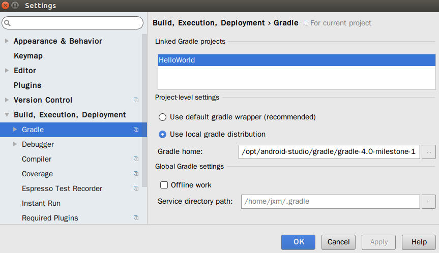
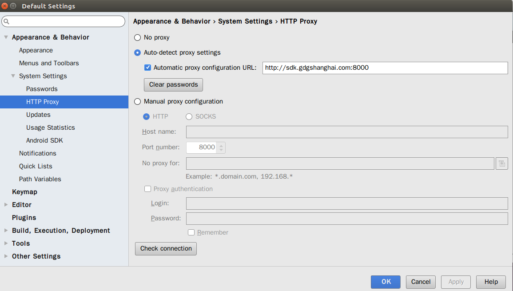
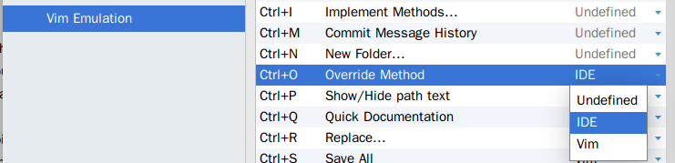

########
安卓学习
########

Download
========

官方下载地址
    https://developer.android.com/studio/index.html

androiddevtools
    http://www.androiddevtools.cn/

google developers
    https://developers.google.cn/

api doc
    http://www.embeddedlinux.org.cn/androidapi/

required
--------

.. code:: sh

    $ sudo apt-get install lib32z1 lib32ncurses5 lib32stdc++6
    $ sudo apt-get install libc6:i386 libncurses5:i386 libstdc++6:i386 lib32z1 libbz2-1.0:i386

gradle
------

    https://services.gradle.org/
    https://services.gradle.org/distributions/gradle-4.0-milestone-1-all.zip

https://jcenter.bintray.com/com/android/tools/build/

`Android studio 关闭 初次启动更新 <http://blog.csdn.net/wyl_1994/article/details/52353647>`_

Android SDK 在线更新镜像服务器资源
-----------------------------------

大连东软信息学院镜像服务器地址:
    http://mirrors.neusoft.edu.cn 端口：80

北京化工大学镜像服务器地址:
    IPv4: http://ubuntu.buct.edu.cn/ 端口：80
    IPv4: http://ubuntu.buct.cn/ 端口：80
    IPv6: http://ubuntu.buct6.edu.cn/ 端口：80

上海GDG镜像服务器地址:
    http://sdk.gdgshanghai.com 端口：8000
中国科学院开源协会镜像站地址:
    IPV4/IPV6: http://mirrors.opencas.cn 端口：80
    IPV4/IPV6: http://mirrors.opencas.org 端口：80
    IPV4/IPV6: http://mirrors.opencas.ac.cn 端口：80
    

.. code:: sh

    $HOME/.gradle/wrapper/dists/gradle-4.0-milestone-1-all/2rnr7rhi2zsmkxo9re7615fy6/gradle-4.0-milestone-1
    /home/jxm/.gradle/wrapper/dists/gradle-4.0-milestone-1-all/2rnr7rhi2zsmkxo9re7615fy6/gradle-4.0-milestone-1-all.zip

修改vim快捷键
-------------

File->Settings->Other Settings->Vim Emulation

Select Methods to Override/Implement

