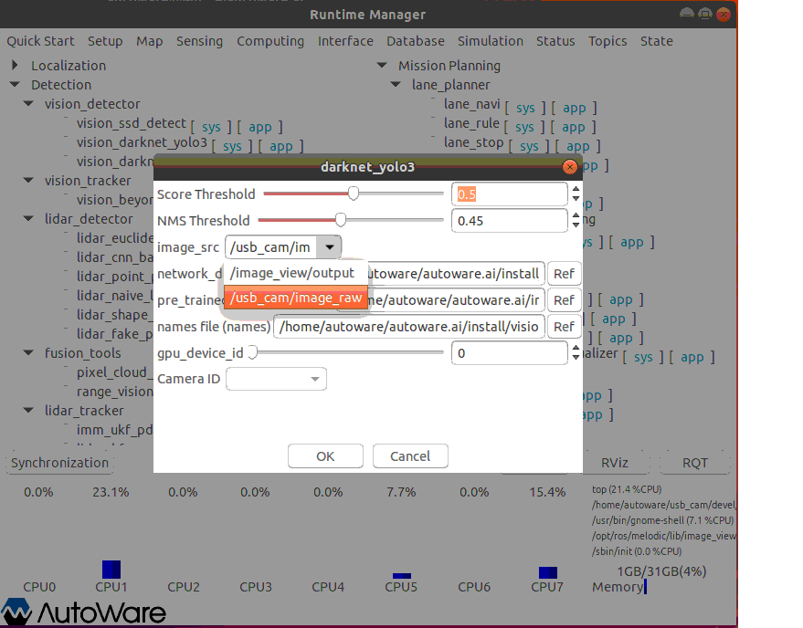
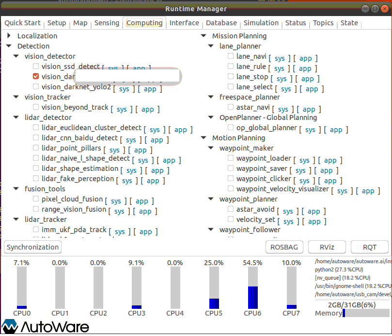
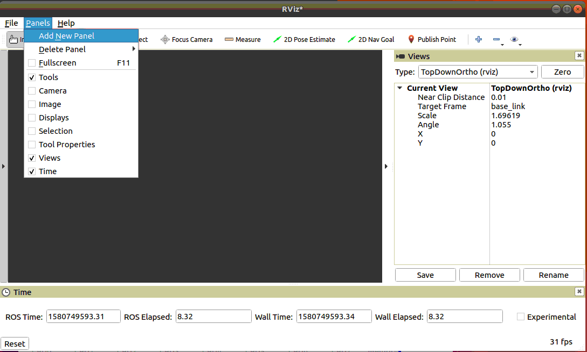
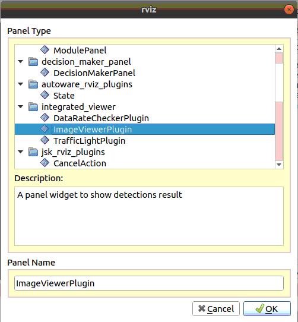
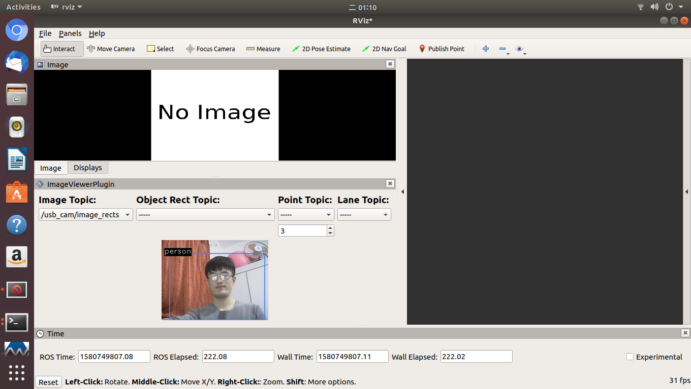

Autoware 
===========

* MIC-7700
    * ubuntu18.04 LTS
    * 32G RAM
    * GPU 1050Ti

一 环境搭建
------------
* `Wiki <https://github.com/Autoware-AI/autoware.ai/wiki>`_
    * `Wiki(gitlib)  <https://gitlab.com/autowarefoundation/autoware.ai/autoware/-/wikis/home>`_
* `矢量地图 <https://account.tier4.jp/accounts/login/>`_


1 安装 ROS melodic
````````````````````

1.1 更新 ROS源地址
:::::::::::::::::::

.. code-block:: sh

        # # 更换阿里源, 网速快; 缺点, 当碰巧,阿里源正在和官方源同步的时段，会无法安装
        # sed -i 's/cn.archive.ubuntu.com/mirrors.aliyun.com/' /etc/apt/sources.list # X86 中文
        # sed -i 's/archive.ubuntu.com/mirrors.aliyun.com/' /etc/apt/sources.list    # X86 英文
        # sed -i 's/ports.ubuntu.com/mirrors.aliyun.com/' /etc/apt/sources.list      # arm 

        #  添加 科大ROS源
        sudo sh -c '. /etc/lsb-release && echo "deb http://mirrors.ustc.edu.cn/ros/ubuntu/ $DISTRIB_CODENAME main" > /etc/apt/sources.list.d/ros-latest.list'

        sudo apt-key adv --keyserver keyserver.ubuntu.com --recv-keys F42ED6FBAB17C654
        sudo apt-get update

1.2 安装 ROS
:::::::::::::::::::

* 执行安装脚本

.. code-block:: sh
    
    sudo apt-get install curl --yes --allow-unauthenticated
    
    # 按照提示输入,当前用户密码
    curl -sSL https://raw.githubusercontent.com/my-rds-store/my_space/master/source/autoware/src/ros_instal.sh | bash


* 安装脚本的源码如下:

  .. literalinclude:: ./src/ros_instal.sh
     :language: bash


2 安装 CUDA 10.0
```````````````````

* Step 1 : revmoe nvidia

    .. code-block:: sh

        sudo apt-get remove --purge nvidia*

* Step 2 : Install cuda 10.0

    `下载链接: cuda-repo-ubuntu1804_10.0.130-1_amd64.deb <https://developer.download.nvidia.com/compute/cuda/repos/ubuntu1804/x86_64/cuda-repo-ubuntu1804_10.1.105-1_amd64.deb>`_

    .. code-block:: sh

        ## Install cuda
        ## https://developer.nvidia.com/cuda-toolkit-archive
        sudo dpkg -i cuda-repo-ubuntu1804_10.0.130-1_amd64.deb
        sudo apt-key adv --fetch-keys http://developer.download.nvidia.com/compute/cuda/repos/ubuntu1804/x86_64/7fa2af80.pub
        sudo apt-get update
        sudo apt-get install cuda-10-0

* Step 3 :  Install cuDNN 


    `先下载 cuDNN v7.5.0 (Feb 21, 2019), for CUDA 10.0 <https://developer.nvidia.com/rdp/cudnn-archive>`_ ;
    需要注册账号登录才能下载.

    .. code-block:: sh

        ## https://developer.nvidia.com/rdp/cudnn-archive
        ## cuDNN v7.5.0 (Feb 21, 2019), for CUDA 10.0

        sudo dpkg -i libcudnn7_7.5.0.56-1+cuda10.0_amd64.deb


* Step 4 :  添加环境变量 

    在 ${HOME}/.bash_aliases 添加

    .. code:: 

        ##################################
        #  CUDA
        ##################################
        export CUDA_HOME=/usr/local/cuda-10.0
        export PATH=$PATH:$CUDA_HOME/bin
        export LD_LIBRARY_PATH=${CUDA_HOME}/lib64${LD_LIBRARY_PATH:+:${LD_LIBRARY_PATH}}


    .. code-block:: sh

        source ${HOME}/.bash_aliases
        # 查看 CUDA 版本
        nvcc -V


* Step 5 : 重启系统 

    .. code-block:: sh

        sudo shutdown -r now


3 源码编译 Autoware
````````````````````````````````

* step 1 : Install Eigen

.. code-block:: sh

    wget http://bitbucket.org/eigen/eigen/get/3.3.7.tar.gz #Download Eigen

    mkdir eigen && tar --strip-components=1 -xzvf 3.3.7.tar.gz -C eigen #Decompress

    cd eigen && mkdir build && cd build && cmake .. && make && sudo make install #Build and install

    cd ../../ && rm -rf 3.3.7.tar.gz && rm -rf eigen #Remove downloaded and temporary files

* step 2 : Build Autoware

**注意**

    .. code::

        NVIDIA Jetson AGX Xavier 
            需要 将libopencv-dev 版本 
            由 4.1.1-2-gd5a58aa75 降为 3.2.0+dfsg-4ubuntu0.1

            sudo apt-get install libopencv-dev=3.2.0+dfsg-4ubuntu0.1

    **build autoware 1.13.0 on  NVIDIA Jetson AGX Xavier**
        * `autoware master branch build on nvidia Jetson AGX Xavier <https://gitlab.com/autowarefoundation/autoware.ai/autoware/-/merge_requests/25/diffs?commit_id=4706665ce4366f66034ecd089902f57426b5a728>`_ 
        * https://www.ncnynl.com/archives/201911/3482.html

    .. code-block:: sh

            cd vendor/mrt_cmake_modules
            git checkout 9ddefc0


.. code-block:: sh

    mkdir -p autoware.ai/src
    cd autoware.ai


    # Download 1.12.0
    wget -O autoware.ai.repos "https://gitlab.com/autowarefoundation/autoware.ai/autoware/raw/1.12.0/autoware.ai.repos?inline=false"

    # Download 1.13.0
    wget -O autoware.ai.repos "https://gitlab.com/autowarefoundation/autoware.ai/autoware/raw/1.13.0/autoware.ai.repos?inline=false"

    # Download master
    wget -O autoware.ai.repos "https://gitlab.com/autowarefoundation/autoware.ai/autoware/raw/master/autoware.ai.repos?inline=false"

    vcs import src < autoware.ai.repos

    ## Install dependencies using rosdep.
    rosdep update
    rosdep install -y --from-paths src --ignore-src --rosdistro $ROS_DISTRO

    # With CUDA support
    AUTOWARE_COMPILE_WITH_CUDA=1 colcon build --cmake-args -DCMAKE_BUILD_TYPE=Release
    AUTOWARE_COMPILE_WITH_CUDA=1 colcon build --packages-up-to gnss_localizer \
                                    --cmake-args -DCMAKE_BUILD_TYPE=Release  


    # Without CUDA Support
    # colcon build --cmake-args -DCMAKE_BUILD_TYPE=Release

* step 2 : Run Autoware

.. code-block:: sh

    cd autoware.ai
    source install/setup.bash
    roslaunch runtime_manager runtime_manager.launch


4. Docker 安装Autoware(整理中....)
`````````````````````````````````````

* 需要 在 autoware 用户下操作. 新建 autoware 用户

.. code::

    #/etc/sudoers 添加
    autoware      ALL=NOPASSWD:ALL
 

.. code-block:: sh

     git clone https://gitlab.com/autowarefoundation/autoware.ai/docker.git

     cd docker/generic

     mkdir ~/Autoware
    ./run.sh --ros-distro melodic 
    ./run.sh --ros-distro melodic --cuda off # 无cuda


   
* `问题: No protocol specified  <https://blog.csdn.net/Niction69/article/details/78480675>`_

.. code-block:: sh
    
    #　root 用户下
    xhost +


5. 学习资料
`````````````

* `autoware入门教程 <https://www.ncnynl.com/archives/201910/3402.html>`_

`二 LGSVL <https://www.lgsvlsimulator.com/docs/>`_
-----------------------------------------------------

.. code-block:: sh
 
    # ubuntu18.04 Install lgsvls imulator
    sudo apt install libcanberra-gtk-module libcanberra-gtk3-module # Failed to load module "canberra-gtk-module"
    sudo apt-get install libgtk2.0-0:i386 libglib2.0-0:i386 libgdk-pixbuf2.0-0:i386 # 待验证
    sudo apt-get install vulkan-utils # 解决: No supported renderes found, exiting 


.. code::

    Windows LGSVL地图及配置文件，下载保存路径为

     用户\AppData\Locallow\LG Silicon Valley Lab\LGSVL Simulator\


Example JSON Configuration for an Autoware Vehicle 
```````````````````````````````````````````````````

* Published Topics 

+-------------------------------------------+--------------+
| Topic                                     | Sensor Name  |
+===========================================+==============+
| `/nmea_sentence`                          | GPS          |
+-------------------------------------------+--------------+
| `/odom`                                   | GPS Odometry |
+-------------------------------------------+--------------+
| `/imu_raw`                                | IMU          |
+-------------------------------------------+--------------+
| `/points_raw`                             | Lidar        |
+-------------------------------------------+--------------+
| `/simulator/camera_node/image/compressed` | Main Camera  |
+-------------------------------------------+--------------+

* Subscribed Topics 

+----------------+----------------------+
| Topic          |  Sensor Name         |
+================+======================+
| `/vehicle_cmd` | Autoware Car Control |
+----------------+----------------------+

* Complete JSON Configuration 

.. code-block:: json

    [
      {
        "type": "GPS Device",
        "name": "GPS",
        "params": {
          "Frequency": 12.5,
          "Topic": "/nmea_sentence",
          "Frame": "gps",
          "IgnoreMapOrigin": true
        },
        "transform": {
          "x": 0,
          "y": 0,
          "z": 0,
          "pitch": 0,
          "yaw": 0,
          "roll": 0
        }
      },
      {
        "type": "GPS Odometry",
        "name": "GPS Odometry",
        "params": {
          "Frequency": 12.5,
          "Topic": "/odom",
          "Frame": "gps",
          "IgnoreMapOrigin": true
        },
        "transform": {
          "x": 0,
          "y": 0,
          "z": 0,
          "pitch": 0,
          "yaw": 0,
          "roll": 0
        }
      },
      {
        "type": "IMU",
        "name": "IMU",
        "params": {
          "Topic": "/imu_raw",
          "Frame": "imu"
        },
        "transform": {
          "x": 0,
          "y": 0,
          "z": 0,
          "pitch": 0,
          "yaw": 0,
          "roll": 0
        }
      },
      {
        "type": "Lidar",
        "name": "Lidar",
        "params": {
          "LaserCount": 32,
          "MinDistance": 0.5,
          "MaxDistance": 100,
          "RotationFrequency": 10,
          "MeasurementsPerRotation": 360,
          "FieldOfView": 41.33,
          "CenterAngle": 10,
          "Compensated": true,
          "PointColor": "#ff000000",
          "Topic": "/points_raw",
          "Frame": "velodyne"
        },
        "transform": {
          "x": 0,
          "y": 2.312,
          "z": -0.3679201,
          "pitch": 0,
          "yaw": 0,
          "roll": 0
        }
      },
      {
        "type": "Color Camera",
        "name": "Main Camera",
        "params": {
          "Width": 1920,
          "Height": 1080,
          "Frequency": 15,
          "JpegQuality": 75,
          "FieldOfView": 50,
          "MinDistance": 0.1,
          "MaxDistance": 1000,
          "Topic": "/simulator/camera_node/image/compressed",
          "Frame": "camera"
        },
        "transform": {
          "x": 0,
          "y": 1.7,
          "z": -0.2,
          "pitch": 0,
          "yaw": 0,
          "roll": 0
        }
      },
      {
        "type": "Manual Control",
        "name": "Manual Car Control"
      },
      {
        "type": "Vehicle Control",
        "name": "Autoware Car Control",
        "params": {
          "Topic": "/vehicle_cmd"
        }
      }
    ]

.. code-block:: sh

    cp -rvf  ./src/autoware/simulation/lgsvl_simulator_bridge/*  \
             ./install/lgsvl_simulator_bridge/share/lgsvl_simulator_bridge/
    source install/setup.bash
    roslaunch runtime_manager runtime_manager.launch
    
    # start
    roslaunch rosbridge_server rosbridge_websocket.launch

    # nvidia  jetson AGX  Xavier  depend
    sudo apt-get install python-bson python-tornado
   
--------

* `LGSVL Simulator python API 整理总结 ------ (待验证) <https://www.jianshu.com/p/9585cb18f0a6>`_
* `罗技 G29 方向盘 ------ (待验证) <https://www.jianshu.com/p/d314f70b26ba>`_

--------


三 问题整理
------------

（ 空 )

四 学习笔记
------------


.. code-block:: sh

    rosrun runtime_manager runtime_manager_dialog.py


使用GNSS进行定位
`````````````````

gpsd
::::::

gpsd是一个GPS的守护进程，用以侦听来自GPS接收器的位置信息，并将这些位置信息转换成一种简化的格式。这样就可以使用其他程序对这些数据进行分析并制作图表等。该软件包中有一个客户端，用以显示当前可见GPS卫星（如果有的话）的位置和速度。它也可以使用差分全球定位系统/ IP协议。

.. code-block:: sh

    sudo apt-get install gpsd gpsd-clients

 
* `Python gpsd bindings <https://www.perrygeo.com/python-gpsd-bindings.html>`_

----

* `How to use Android phone as GPS sensor in Linux <https://miloserdov.org/?p=3762>`_

  .. code-block:: sh
    
    systemctl stop    gpsd
    systemctl disable gpsd
    sudo shutdown -r now   # 需要关机重启，启动 启动 gpad -N .... 会报错。


    sudo apt-get install adb

    ###########
    cgps
    gpsmon

* `Warwalking With Linux and Android <https://pentasticweb.wordpress.com/2016/05/27/warwalking-with-linux-and-android/>`_
    * https://www.jillybunch.com/sharegps/nmea-usb-linux.html


gpsfake
:::::::::::::::

* 使用gpsfake模拟GPS数据

    .. code:: 

        1. 将假的gps数据存到文件中，命名为test.log.

               nc localhost 20175  >> test.log
               或者
               curl <phone ip>:port >> test.log

        2. ls /dev/pts,查看现在有什么设备。我的有三个，分别是0，1，ptmx。

        3. gpsfake -c 0.2 test.log  #  0.2秒 发送一条数据

        4. ls /dev/pts再次查看。这时候有四个了，分别是0,1,2,ptmx.

        5. cat /dev/pts/2. 就可以看到假的gps数据了。

        6. gpsd -F -D3 -N /dev/pts/2

        7 cgps 或者 gpsmon


    * `gpsd_client-Tutorials <http://wiki.ros.org/gpsd_client/Tutorials/Getting%20Started%20with%20gpsd_client>`_

    .. code-block:: sh 

        # 8. 
        rosrun gpsd_client gpsd_client _host:=localhost _port:=2947

        #9. 
        rostopic echo /fix
        
 `nmea_navsat_driver <https://wiki.ros.org/nmea_navsat_driver>`_
    * `run nmea_serial_driver <https://autoware.readthedocs.io/en/feature-documentation_rtd/DevelopersGuide/PackagesAPI/sensing/scripts.html>`_

    .. code-block:: sh 

       gpsfake -c 0.2 test.log  #  0.2秒 发送一条数据

       rosrun nmea_navsat_driver nmea_serial_driver _port:=/dev/pts/7 _baud:=4800

       rostopic list
       rostopic echo /fix
       rostopic echo /vel 
       rostopic echo /time_reference

gnss_localizer 
:::::::::::::::

https://github.com/autowarefoundation/autoware/issues/492


.. code-block:: sh

    find . -name "*.py" -or -name "*.yaml"| xargs grep -in plane
    find . -name "*.c*" -or -name "*.h*" -or -name "*.launch" -or -name "*.py" | xargs grep -in set_plane

    vim ./autoware/utilities/runtime_manager/scripts/computing.yaml +1281
    vim ./autoware/utilities/autoware_launcher/plugins/refs/nmea2tfpose.yaml +11

    vim ./autoware/core_perception/gnss_localizer/launch/fix2tfpose.launch +4
    vim ./autoware/core_perception/gnss_localizer/nodes/nmea2tfpose/nmea2tfpose_core.cpp +46

    vim ./autoware/common/gnss/src/geo_pos_conv.cpp +52


fix2tfpose
'''''''''''''''

.. code-block:: cpp

  pose_publisher = nh.advertise<geometry_msgs::PoseStamped>("gnss_pose", 1000);
  stat_publisher = nh.advertise<std_msgs::Bool>("/gnss_stat", 1000);
  ros::Subscriber gnss_pose_subscriber = nh.subscribe("fix", 100, GNSSCallback);


`路径跟踪基本配置 <https://qiita.com/hakuturu583/items/297adfd8ad0fa54d1a24>`_
````````````````````````````````````````````````````````````````````````````````

录制rosbag包
::::::::::::::::

.. code-block:: cpp

    rosbag record -O name.bag /points_raw

rosbag建图
::::::::::::::::

**Runtime Manager** 

* Setup  

.. code::

    TF -  x: 1.2, y: 0, z: 2 ;  这是 LIDAR 传感器在车身坐标系中的位置。 
                                设置 transform 是为了建立 LIDAR 坐标系
                                与车身坐标系的转换关系。
    Vehicle Model

* Computing 

.. code::

    ndt_mapping : 借助 NDT 算法实现 SLAM。
    ndt_mapping[app] : ref设定保存pcd文件的路径, 建图结束后 ,点击 `PCD OUTPUT` 保存pcd。


rviz，配置文件 Autoware/ros/src/.config/rviz/ndt_mapping.rviz。

建图不一定每次都成功，有时候 NDT 算法匹配的不好，地图可能很混乱。我们的经验是，在收集 LIDAR 数据的时候车辆*行驶慢一些*，如果建图不成功，就多尝试几次，每次都重新收集一次数据.


生成 Waypoint
::::::::::::::::

* Setup 

.. code::

    TF  -  x: 1.2, y: 0, z: 2
    Vehicle Model

* Map 

.. code::

  Point Cloud : 加载pcd
  TF : 加载 lgsvl-tf.launch

.. code-block:: xml

    <!-- lgsvl-tf.launch -->

    <launch>
    <node pkg="tf"  type="static_transform_publisher" name="world_to_map" args="0 0 0 0 0 0 /world /map 10" />
    <node pkg="tf"  type="static_transform_publisher" name="map_to_mobility" args="0 0 0 0 0 0 /map /mobility 10" />
    </launch>

* Sensing 

.. code::

    Point Downsampler -> voxel_grid_filter 

* Computing 

.. code::

    lidar_localizer -> ndt_matching : 注意，要在 app 中 initial pose，数值全为 0.

    autoware connector -> vel_pose_connect  这里是将 ndt 估计出的 pose 和 velocity 
                                              名字改为 current_pose, current_velocity，
                                              以便后续 pure-pursuit node 使用.

    waypoing_maker -> waypoint_saver : 设置好路径点文件的名字和保存路径。

航点导航
:::::::::

* Sensing 

.. code::

    Point Downsampler -> voxel_grid_filter 

* Computing 

.. code::

     lidar_localizer    -> ndt_matching : 注意，要在 app 中 initial pose，数值全为 0; 
                                              这是 NDT 点云匹配的初始位置
     autoware connector -> vel_pose_connect

* Mission Planning

.. code::

    * lane_planner -> lane_rule 
                   -> lane_stop 
                   -> lane_select

* Motion Planning

.. code::

    waypoing_maker -> waypoint_loader - 加载刚才生成的路径点文件
                   -> path_select

    waypoint_planner -> astar_void 
                     -> velocity_set

    waypoint_follower -> pure_pursuit 
                      -> twist_filter

    lattice_planner -> lattice_velocity_set  


Autoware Camera-LiDAR Calibration Package
```````````````````````````````````````````

* `Autoware Camera-LiDAR Calibration <https://gitlab.com/autowarefoundation/autoware.ai/utilities/-/tree/master/autoware_camera_lidar_calibrator>`_

*  节点拓扑图 待整理

.. code-block:: sh

    # calibration_publisher

    CALIBRATION=$(pwd)/calibration/autoware_lidar_camera_calibration.yaml

    roslaunch runtime_manager calibration_publisher.launch target_frame:=velodyne camera_frame:=camera file:=${CALIBRATION} \
    register_lidar2camera_tf:=True publish_extrinsic_mat:=True publish_camera_info:=True \
    camera_info_topic:=/camera_info2  \
    image_topic_src:=/image_raw  \
    projection_matrix_topic:=/projection_matrix  \
    camera_id:=/cv_camera


    # points2image
    roslaunch runtime_manager  points2image.launch  camera_id:=/cv_camera camera_info_src:=/camera_info2

    #######################################################################
    #
    # rosrun topic_tools relay /cv_camera/image_raw /image_raw

    #CALIBRATION=$(pwd)/calibration/autoware_lidar_camera_calibration.yaml
    #roslaunch runtime_manager calibration_publisher.launch target_frame:=velodyne camera_frame:=camera file:=${CALIBRATION}  \
    #        register_lidar2camera_tf:=True publish_extrinsic_mat:=True publish_camera_info:=True \
    #        camera_info_topic:=/camera_info  \
    #        image_topic_src:=/image_raw       \
    #        projection_matrix_topic:=/projection_matrix camera_id:=/

    # #points2image
    #roslaunch runtime_manager  points2image.launch  camera_id:=/ camera_info_src:=camera_info


Traffic Light Recognition
````````````````````````````````````

* `Traffic Light Recognition <https://i.youku.com/i/UNDIxMDQ1MTkzNg==?spm=a2h0j.11185381.module_basic_dayu_sub.DLDDH2~A>`_

.. raw:: html

    <iframe height=650 width=1100 src='https://player.youku.com/embed/XMjg5MzQ0MjEzNg==' frameborder=0 'allowfullscreen'></iframe>

使用YOLOv3进行检测
``````````````````

* `Running yolov3 detection in autoware <https://youtu.be/M5K2xc6ndtA>`_

.. raw:: html

    <iframe width="560" height="315" src="https://www.youtube.com/embed/M5K2xc6ndtA" frameborder="0" allow="accelerometer; autoplay; encrypted-media; gyroscope; picture-in-picture" allowfullscreen></iframe>

Step 1: 安装Yolo3
::::::::::::::::::

* `安装Yolo  <https://www.ncnynl.com/archives/201911/3439.html>`_

Step 2: usb_cam
::::::::::::::::

.. code-block:: sh

    sudo apt install ros-melodic-cv-camera

    rosparam set cv_camera/device_id 2

    rosrun cv_camera cv_camera_node

    rostopic echo /cv_camera/image_raw

.. code-block:: bash

    mkdir -p usb_cam 
    cd usb_cam 

    #git clone https://github.com/bosch-ros-pkg/usb_cam src
    git clone https://github.com/ros-drivers/usb_cam.git src

    catkin_make 
    source devel/setup.bash 

    roscore  &
    source devel/setup.bash 
    roslaunch usb_cam usb_cam-test.launch

Step 3
::::::::::::::::

* Computing->Detection->vision_detector->vision_darknet_yolo3/[app]





* 打卡 Rviz







* How to use object detection package in Autoware 

.. raw:: html

  <iframe width="560" height="315" src="https://www.youtube.com/embed/rCSzirRForc" frameborder="0" allow="accelerometer; autoplay; encrypted-media; gyroscope; picture-in-picture" allowfullscreen></iframe>

------------------

* `RoboSense-LiDAR <https://github.com/RoboSense-LiDAR/ros_rslidar.git>`_

.. code:: 

    $ git diff

    diff --git a/rslidar_pointcloud/launch/cloud_nodelet.launch b/rslidar_pointcloud/launch/cloud_nodelet.launch
    index 6f0869a..a3ef4e9 100644
    --- a/rslidar_pointcloud/launch/cloud_nodelet.launch
    +++ b/rslidar_pointcloud/launch/cloud_nodelet.launch
    @@ -15,6 +15,9 @@
         <param name="device_ip" value="$(arg device_ip)" />
         <param name="msop_port" value="$(arg msop_port)" />
         <param name="difop_port" value="$(arg difop_port)"/>
    +
    +    <!-- support autoware  -->
    +    <param name="frame_id" type="string" value="velodyne"/>
       </node>
     
       <node pkg="nodelet" type="nodelet" name="$(arg manager)_cloud"
    @@ -24,5 +27,7 @@
         <param name="angle_path" value="$(find rslidar_pointcloud)/data/rs_lidar_16/angle.csv" />
         <param name="channel_path" value="$(find rslidar_pointcloud)/data/rs_lidar_16/ChannelNum.csv" />
     
    +       <!-- support autoware  -->
    +       <remap from="rslidar_points" to="/points_raw"/>
       </node>
     </launch>

.. code-block:: sh

   rostopic echo /points_raw     | grep frame_id

--------------------


Jetson Tx2 
-------------------

刷机 sdkmanager_1.1.0-6343
     jetpack 4.3  

* `arm64架构安装vscode——tx2安装vscode  <https://packagecloud.io/headmelted/codebuilds>`_

* `tx2 ubuntu18安装中文输入法，并解决无候选框的问题 <https://blog.csdn.net/xunchou/article/details/93754697>`_

=====

* `Stop Chromium asking for keyring unlock <https://voltaicforge.com/games/chromium-gnome-keyring/>`_

.. code-block:: bash

    chromium --password-store=basic 

Jetson AGX Xavier
-------------------

刷机 sdkmanager_1.1.0-6343
     jetpack 4.3  


.. raw:: html
   :file: ./jetson_nvpmodel.html


.. code-block:: sh

    tegrastats

    sudo nvpmodel --query
    sudo nvpmodel -q --verbose

    sudo nvpmodel -p --verbose
    sudo nvpmodel -m 0  # 0 - MAXN ; 
                        # 1 - MODE_10W ;  默认
                        # 2 - MODE_15W ; 
                        # 3 - MODE_30W_ALL ; 
                        # 4 - MODE_30W_6CORE ; 
                        # 5 - MODE_30W_4CORE ; 
                        # 6 - MODE_30W_2CORE ; 


    sudo jetson_clocks --show

    echo 255 > target_pwm
    sudo cp -vf target_pwm /sys/devices/pwm-fan/target_pwm  # 风扇开到最大

----

* QT5

.. code-block:: sh

    sudo apt-get install qt5-default qtcreator -y
    sudo  apt isntall libqt5charts5 libqt5charts5-dev

----

* ubuntu sudo 免密码 

.. code-block:: sh

    sudo tee /etc/sudoers.d/nopasswd4sudo <<- 'EOF'
    nvidia ALL=(ALL) NOPASSWD : ALL  
    EOF

----

* `NVIDIA Xavier CAN <https://blog.csdn.net/weifengdq/article/details/103093111#JetsonAGX_Xavier_CAN_17>`_

* `can_xavier <https://github.com/hmxf/can_xavier>`_

----

* `Enabling CAN on Nvidia Jetson Xavier <https://medium.com/@ramin.nabati/enabling-can-on-nvidia-jetson-xavier-developer-kit-aaaa3c4d99c9>`_

.. code-block:: sh

    # 开机自启动
    sudo tee -a /etc/rc.local <<- 'EOF'
    #!/bin/bash
    bash /enable_CAN.sh &
    exit 0
    EOF
    sudo chmod a+x /etc/rc.local 


.. code-block:: sh

    ######################
    # enable_CAN.sh
    ######################
    
    sudo modprobe can
    sudo modprobe can_raw
    sudo modprobe mttcan

    #############################
    # 用devmem修改寄存器
    #############################
    sudo busybox devmem 0x0c303000 32 0x0000C400
    sudo busybox devmem 0x0c303008 32 0x0000C458
    sudo busybox devmem 0x0c303010 32 0x0000C400
    sudo busybox devmem 0x0c303018 32 0x0000C458

    # # 检查寄存器
    # sudo busybox devmem 0x0c303000	# 0x0000C055
    # sudo busybox devmem 0x0c303008	# 0x0000C055
    # sudo busybox devmem 0x0c303010	# 0x0000C059
    # sudo busybox devmem 0x0c303018	# 0x0000C059

    # 配置标准CAN  500k
    sudo ip link set can0 type can bitrate 500000
    sudo ip link set can1 type can bitrate 500000

    # 配置为仲裁段500k, 数据段2M的的CANFD:
    #sudo ip link set can0 type can bitrate 500000 dbitrate 2000000 berr-reporting on fd on
    #sudo ip link set can1 type can bitrate 500000 dbitrate 2000000 berr-reporting on fd on

    # 设置本地回环
    #sudo ip link set can0 type can bitrate 500000 loopback on
    #sudo ip link set can1 type can bitrate 500000 loopback on


    #sudo ip link set down can0
    #sudo ip link set down can1

    sudo ip link set up can0
    sudo ip link set up can1

    # 
    cansend can0 "601#b110ff"
    cansend can1 "601#b110ff"


    #sudo nvpmodel -m 0

    sudo echo 255 > target_pwm
    sudo cp -vf target_pwm /sys/devices/pwm-fan/target_pwm  # 风扇开到最大

    # 禁用串行控制台
    #sudo systemctl stop nvgetty
    #sudo systemctl disable nvgetty
    #udevadm trigger  # 串口 /dev/ttyTHS0

---------

* Jetson TX2——CAN口的使用 `<https://blog.csdn.net/xuezhunzhen9743/article/details/81877757>`_


.. code-block:: sh

    modprobe can        // 插入 can 总线子系统
    modprobe can-raw    // 插入can 协议模块
    modprobe can-bcm
    modprobe can-gw  
    modprobe can-dev
    modprobe mttcan      //真正的can口支持

---------

* `NVIDIA Xavier UART <https://blog.csdn.net/weifengdq/article/details/103071182>`_
* `jetson-nano-uart <https://www.jetsonhacks.com/2019/10/10/jetson-nano-uart/>`_

.. code-block:: sh

    # 禁用串行控制台 ttyTHS*
    sudo systemctl stop nvgetty
    sudo systemctl disable nvgetty
    udevadm trigger  # 串口 /dev/ttyTHS0

    # sudo usermod -a -G dialout $USER
    ## sudo chmod a+wrx /dev/ttyTHS0

------------------

* `nvida agx vnc 屏幕共享 <https://medium.com/@bharathsudharsan023/jetson-nano-remote-vnc-access-d1e71c82492b>`_

**1**

.. code-block:: sh

    sudo vim /usr/share/glib-2.0/schemas/org.gnome.Vino.gschema.xml
 
.. code-block:: xml

   <!-- and go ahead and add the following key into the XML file. -->

    <key name='enabled' type='b'>
       <summary>Enable remote access to the desktop</summary>
       <description>
       If true, allows remote access to the desktop via the RFB
       protocol. Users on remote machines may then connect to the
       desktop using a VNC viewer.
       </description>
       <default>false</default>
    </key>

.. code-block:: sh

     # 更新
    # Then compile the Gnome schemas with the glib-compile-schemas command. 

    sudo glib-compile-schemas /usr/share/glib-2.0/schemas

    # 关闭 encryption of the VNC
    #  或者使用图形界面配置工具 dconf editor 'sudo apt-get install dconf-editor'

    gsettings set org.gnome.Vino require-encryption false
    gsettings set org.gnome.Vino prompt-enabled false


**2**

 
    打开 `startup applications` .
    
    添加 command `/usr/lib/vino/vino-server`. 

    然后，重启系统

.. image:: img/startup_applications.png


**3**

.. code-block:: sh

    vncviewer 192.168.2.105:5900


MapToolbox
-------------------

* https://github.com/autocore-ai/MapToolbox.git 
* https://github.com/tier4/MapToolbox

.. raw:: html

    <iframe width="560" height="315" src="https://www.youtube.com/embed/WTRHPs8pN04" frameborder="0" allow="accelerometer; autoplay; encrypted-media; gyroscope; picture-in-picture" allowfullscreen></iframe>


惠普暗影精灵5 Plus
-------------------

惠普暗影精灵5 Plus 装　ubuntu 18.04 踩到的坑.

* 结合这两篇Blog , 解决ubuntu 18.04 安装问题

    * http://keyblog.cn/article-139.html
    * https://blog.csdn.net/xiaxinkai/article/details/103739698

`ACPI Error: No handler or method for GPE` => kernel 5.5 rc1 已经修正了这个问题。
kernel  >= 5.5 的 Ubutnu  应该不存在这个问题

::

    安装步骤 刻录 Ubuntu 18.04 U盘启动

    装系统-> 选择 UEFI 启动
        当看到“Try Ubuntu", “Install Ubuntu”, “…” 这个黑色界面的时候按"e"，然后可以看到一段英文，把段落中的"quiet splash"修改成"nomodeset"，修改完按F10重启。（重要：不这样操作可能会卡住，无法启动安装器）
        安装器若启动不起来，多尝试几次．

    安装过程，联网更新软件，并且勾选　第三方库安装．

    ===========

    安装完毕,重启
    在ubuntu选项上按e，进入启动命令编辑, 把段落中的"linux"打头的一行，找到quiet splash替换为text acpi=off，然后按F10启动。


    进入桌面，更改为　国内源，然后 软件更新．

    打开software updater，选择additional drivers，点击NVIDIA driver 435，点击Apply Changes。


    安装完驱动，不要重启，打开终端，安装vim，然后sudo vim /etc/default/grub，修改一下两行：

    GRUB_CMDLINE_LINUX_DEFAULT="text"
    GRUB_CMDLINE_LINUX="pci=nommconf"


*  `没有声音问题 <https://www.linuxuprising.com/2018/06/fix-no-sound-dummy-output-issue-in.html>`_

.. code-block:: sh

    echo "options snd-hda-intel model=auto" | sudo tee -a /etc/modprobe.d/alsa-base.conf
    echo "options snd-hda-intel dmic_detect=0" | sudo tee -a /etc/modprobe.d/alsa-base.conf
    echo "blacklist snd_soc_skl" | sudo tee -a /etc/modprobe.d/blacklist.conf
    shutdown -r now


usb无线wifi
-------------------

* (AC1750) Edimax ew-7833uac on 18.04

* `Need rtl8814au driver for kernel 5.3 on Ubuntu 19.10 <https://askubuntu.com/questions/1185952/need-rtl8814au-driver-for-kernel-5-3-on-ubuntu-19-10>`_

.. code-block:: sh

    sudo apt install git dkms
    git clone https://github.com/aircrack-ng/rtl8812au.git
    cd rtl8812au
    sudo ./dkms-install.sh
