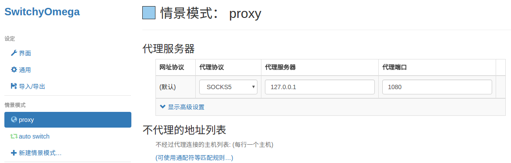

##########
科学上网
##########

                          *一枝红杏出墙来!!!*

.. image:: https://ss0.bdstatic.com/70cFuHSh_Q1YnxGkpoWK1HF6hhy/it/u=1821475898,231081266&fm=27&gp=0.jpg
    :alt: alternate text
    :align: center

* `科学上网漫游指南 <https://lvii.gitbooks.io/outman/content/>`_
* `科学上网漫游指南GitBook <https://www.gitbook.com/book/lvii/outman/details>`_
 
************
VPS厂商
************

* `搬瓦工 <https://bwh1.net/>`_
* `Vultr(中文网) <https://buy.shangyufeidi.com/vultr/?f=bad>`_
* https://www.vultr.com

`快速搭建 <https://hub.docker.com/r/mritd/shadowsocks/>`_ 
========================================================================

方案1（未加速）
-----------------

.. code-block:: sh

    $ curl -sSL https://get.docker.com/ | sh
     
    # server
    $ sudo firewall-cmd --zone=public --add-port=8500/udp --permanent  # 开启服务端 端口

    $ docker run -d --restart=always --name ssserver -p 6443:6443 mritd/shadowsocks -s "-s 0.0.0.0 -p 6443 -m aes-256-cfb -k rootroot --fast-open"

    # client
    $ docker run -d --restart=always --name ssclient -p 1080:1080 mritd/shadowsocks \
      -m "ss-local" -s "-s $SSSERVER_IP -p 6443 -b 0.0.0.0 -l 1080 -m aes-256-cfb -k rootroot --fast-open" 

方案2 （kcptun 加速,24小时内 被封）
--------------------------------------

.. code-block:: sh

    # server
    $ sudo firewall-cmd --zone=public --add-port=8500/udp --permanent  # 开启服务端 端口
    $ sudo docker run -d --restart=always --name ssserver -p 6443:6443 -p 8500:8500/udp mritd/shadowsocks \
      -m "ss-server" -s "-s 0.0.0.0 -p 6443 -m aes-256-cfb -k meiyoumima --fast-open -n 5 " \
      -x -e "kcpserver" -k "-t 127.0.0.1:6443 -l :8500 -mode fast2"

    # client
    $ sudo docker run -d --restart=always --name ssclient -p 1080:1080 mritd/shadowsocks \
      -m "ss-local" -s "-s 127.0.0.1 -p 8500 -b 0.0.0.0 -l 1080 -m aes-256-cfb -k meiyoumima --fast-open" \
      -x -e "kcpclient" -k "-r $SSSERVER_IP:8500 -l :8500 -mode fast2"

方案3  `Udp2raw-tunnel <https://github.com/wangyu-/udp2raw-tunnel/blob/master/doc/kcptun_step_by_step.md>`_
----------------------------------------------------------------------------------------------------------------

.. code-block:: sh

   # ssserver
   docker run -d --restart=always --name ssserver -p 6443:6443 mritd/shadowsocks -s "-s 0.0.0.0 -p 6443 -m aes-256-cfb -k rootroot --fast-open"

   # kcptun server 
   ./server_linux_amd64 -t "0.0.0.0:6443" -l ":4000" -mode fast2  -mtu 1200

   # hudp2raw server
   ./udp2raw_amd64 -s -l 0.0.0.0:2096 -r 0.0.0.0:4000 -k "passwd:meiyoumima" --raw-mode faketcp -a

   ####-------- G -- F -- W  -------####

   # hudp2raw client
   ./udp2raw_amd64 -c -r $SERVER_IP:2096 -l 0.0.0.0:4000 --raw-mode faketcp -a -k "passwd:meiyoumima"

   # kcptun client 
   ./client_linux_amd64  -r "0.0.0.0:4000" -l ":8388" -mode fast2 -mtu 1200
    
   # ssclient
   sudo docker run -d  --name ssclient -p 1081:1080 mritd/shadowsocks -m "ss-local" -s "-s 192.168.2.3 -p 8388 -b 0.0.0.0 -l 1080 -m aes-256-cfb -k rootroot --fast-open"

*************************
1. 牛逼的shadowsocks          
*************************

* `GitHub shadowsocks <https://github.com/ziggear/shadowsocks>`_

* `brook <https://github.com/txthinking/brook>`_

安装 shadowsocks
==================

.. code-block:: bash

    # ubuntu
    $ export LC_ALL=C
    $ sudo apt-get install python-pip 

    $ sudo pip install --upgrade pip -i https://pypi.mirrors.ustc.edu.cn/simple
    $ sudo pip install shadowsocks  -i https://pypi.mirrors.ustc.edu.cn/simple

* `docker shadowsocks <https://hub.docker.com/r/mritd/shadowsocks/>`_
* `kcptun <https://www.cmsky.com/kcptun/>`_

配置 shadowsocks
==================

* `Configuration via Config File <https://github.com/shadowsocks/shadowsocks/wiki/Configuration-via-Config-File>`_

Server  
--------

.. code-block:: bash
    
    #  1. 手动启动

    $ sudo ssserver -p 8388 -k password -m aes-256-cfb --user nobody -d start

    # 2. 配置自动启动(ubuntu)
    $ sudo tee /etc/shadowsocks.json <<-'EOF'
    {
        "server":"my_server_ip",
        "server_port":8388,
        "local_address": "127.0.0.1",
        "local_port":1080,
        "password":"mypassword",
        "timeout":300,
        "method":"aes-256-cfb",
        "fast_open": false,
        "workers": 100
    }
    EOF

    $ sudo tee /etc/init.d/shadowsocks-start.sh <<-'EOF'
    #! /bin/sh
    ### BEGIN INIT INFO
    # Provides:          shadowsocks
    # Required-Start:    $remote_fs $syslog
    # Required-Stop:     $remote_fs $syslog
    # Should-Start:      $network $time
    # Should-stop:       $network $time
    # Default-Start:     2 3 4 5
    # Default-Stop:      0 1 6
    # Short-Description: shadowsocks.
    ### END INIT INFO
    /usr/local/bin/ssserver -c /etc/shadowsocks.json -d start
    EOF

    # 设置启动等级： 
    $ sudo chmod a+x /etc/init.d/shadowsocks-start.sh
    $ sudo update-rc.d shadowsocks-start.sh defaults 90

    $ service shadowsocks-start.sh start/stop/restart

* `在CentOS下配置自启动服务 <http://imchao.wang/2014/02/21/make-your-service-autostart-on-linux/>`_

Client
------
    
* Ubuntu

.. code-block:: bash

    $ sudo tee /etc/shadowsocks.json <<-'EOF'
    {
        "server":"my_server_ip",
        "server_port":8388,
        "local_address": "127.0.0.1",
        "local_port":1080,
        "password":"mypassword",
        "timeout":300,
        "method":"aes-256-cfb",
        "fast_open": true,
        "workers": 100
    }
    EOF

    # workers - 并发数
    
    # 手动启动，停止
    $ sudo sslocal -c /etc/shadowsocks.json
    $ sudo sslocal -c /etc/shadowsocks.json -d start
    $ sudo sslocal -c /etc/shadowsocks.json -d stop
    $ sudo sslocal -c /etc/shadowsocks.json -d restart

    # 配置开机自启动
    $ sudo tee /etc/init.d/shadowsocks-start.sh <<-'EOF'
    #!/bin/sh
    ### BEGIN INIT INFO
    # Provides:          shadowsocks
    # Required-Start:    $remote_fs $syslog
    # Required-Stop:     $remote_fs $syslog
    # Should-Start:      $network $time
    # Should-stop:       $network $time
    # Default-Start:     2 3 4 5
    # Default-Stop:      0 1 6
    # Short-Description: shadowsocks.
    ### END INIT INFO
    /usr/local/bin/sslocal -c /etc/shadowsocks.json -d start
    EOF

    # 设置启动等级： 
    $ sudo chmod a+x /etc/init.d/shadowsocks-start.sh
    $ sudo update-rc.d shadowsocks-start.sh defaults 90

    # 测试
    $ google-chrome --proxy-server=socks5://127.0.0.1:1080

* Windows_ / OSX_ 

.. _Windows: https://github.com/shadowsocks/shadowsocks-csharp
.. _OSX: https://github.com/shadowsocks/shadowsocks-iOS/wiki/Shadowsocks-for-OSX-Help

* Android_ / iOS_ 

.. _Android: https://github.com/shadowsocks/shadowsocks-android 
.. _iOS: https://github.com/shadowsocks/shadowsocks-iOS/wiki/Help

* OpenWRT_ 

.. _OpenWRT: https://github.com/shadowsocks/openwrt-shadowsocks

参考
============

* https://www.cnblogs.com/cursorhu/p/7157257.html

* http://blog.csdn.net/lee_j_r/article/details/54019691
* https://www.8dlive.com/post/168.html
* http://xinwen.eastday.com/a/170207195821936.html
    

kcptun 加速
==============

* `kcptun  <https://github.com/xtaci/kcptun>`_   
* `Using shadowsocks and kcptun <http://litaotju.github.io/2017/05/14/Uwssing-shadowsocks-and-kcptun/>`_

+--------------+------------------------------+--------------------------+
| 属性         |  客户端                      |  服务器                  |
+==============+==============================+==========================+
| listener_port| 与shadowsocks交互的端口      |  对外的端口              |
+--------------+------------------------------+--------------------------+
| target_ip    | 服务器的IP                   |  本机                    |
+--------------+------------------------------+--------------------------+
| target_port  | 服务器的端口（listen_port）  |  与shadowsocks交互的端口 |
+--------------+------------------------------+--------------------------+

-------

* `kcptun-android <https://github.com/shadowsocks/kcptun-android/releases>`_

参考       
-----------

* `搬瓦工VPS/OPENVZ加速工具kcptun <https://www.cmsky.com/kcptun/>`_

****************************
2. 神奇的SwitchyOmega             
****************************

配置代理
============

 
配置自动切换
============

* `gfwlist <https://github.com/gfwlist/gfwlist>`_

*导入在线，规则列表，立即更新情景模式*

.. code:: 

    在线规则列表:
    https://raw.githubusercontent.com/gfwlist/gfwlist/master/gfwlist.txt 

.. image:: ./image/auto_switch.png
    :scale: 100%
    :alt: alternate text
    :align: center
 
参考
============

* `Chrome 配置 SwitchyOmega <http://www.cylong.com/blog/2017/04/09/chrome-SwitchyOmega/>`_
* `SS + SwitchyOmega实现代理自动切换 <https://eliyar.biz/AutoProxy-By-Shadowsocks-and-SwitchyOmega/>`_

************************************
3. polipo http/https的代理转发
************************************

Shadowsocks是我们常用的代理工具,它使用socks5协议,而终端很多工具目前只支持http和https等协议,对socks5协议支持不够好, 所以需要将socks协议转换成http协议.

.. code-block:: bash

    # ubuntu
    $ sudo apt-get install polipo
    $ sudo polipo -v
    $ man polipo
    # the default values.  See /usr/share/doc/polipo/examples/config.sample
    
    # mac
    $ brew  search polipo
    $ sudo mkdir /etc/polipo

.. code-block:: bash

    $ sudo tee /etc/polipo/config <<-'EOF'

    # This file only needs to list configuration variables that deviate
    # from the default values.  See /usr/share/doc/polipo/examples/config.sample
    # and "polipo -v" for variables you can tweak and further information.

    logSyslog = true
    logFile = /var/log/polipo/polipo.log

    socksParentProxy = "127.0.0.1:1080"
    socksProxyType = socks5

    proxyAddress = "0.0.0.0"
    proxyPort = 8123
    allowedClients = 127.0.0.1, ::1, 192.168.8.0/24 
    
    EOF

    # ubuntu
    $ sudo service polipo restart

    # mac
    $ sudo mkdir /var/log/polipo
    $ sudo polipo socksParentProxy=localhost:1080

:: 

    socksParentProxy : 上级代理ip,端口
    socksProxyType   : 是上级代理类型

    proxyAddress     : 监听的ip
    proxyPort        : 是本地监听端口
    allowedClients   : 是允许连接ip范围

.. code-block:: bash

    # 以ubuntu 测试通过
    echo -e "\n------------------------------------------\n"
    curl ip.gs
    #curl ifconfig.me
    echo -e "\n------------------------------------------\n"

    export https_proxy=https://127.0.0.1:8123
    export  http_proxy=http://127.0.0.1:8123
    export HTTPS_PROXY=https://127.0.0.1:8123
    export  HTTP_PROXY=http://127.0.0.1:8123

    curl ip.gs
    #curl ifconfig.me
    echo -e "\n------------------------------------------\n"

    $ git config --global http.proxy=localhost:8123
 
* `How To setup polipo on OSX <https://gist.github.com/maoo/3262589c9db989c6e948>`_

************************************
4. 端口转发
************************************

* 内网渗透之端口转发与代理工具总结:
	* https://www.freebuf.com/articles/web/170970.html
	* https://github.com/Brucetg/Pentest-tools.git
        * /home/promote/Documents/Pentest-tools/端口转发

.. code-block:: sh

    #端口转发
    lcx.exe -slave 192.168.8.6 8888 127.0.0.1 9666
    lcx.exe -listen  8888 8889  #将 8888 转发到 8889 

    ## 代理
    lcx.exe -tran 8889 127.0.0.1 9666

    ##　端口转发示例３　
    lcx.exe -slave 192.168.8.100 8888 127.0.0.1 9666　　  # windows  端运行 无界端口 127.0.01:9666
    ./portmap -m 2 -p1 8889 -h2  192.168.8.100 -p2 8888　  # Linux端(192.168.8.100)  ,上网配置 8889 

    ## 待研究： https://www.freebuf.com/articles/network/244567.html

-------

* `SSH 只能用于远程 Linux 主机？那说明你见识太小了! <https://blog.csdn.net/mingongge/article/details/108525571>`_

.. code-block:: sh

    ssh -L 1080:127.0.0.1:1080 192.168.3.19
    ssh -L 1089:127.0.0.1:1089 promote@192.168.3.19

参考
============

* `Mac+shadowsocks+polipo快捷实现终端科学上网 <https://segmentfault.com/a/1190000008449046>`_

* `Shadowsocks + Polipo 配置全局代理(Linux 版本) <https://blog.csdn.net/jon_me/article/details/53525059/>`_
* `shadowsocks和polipo配置全局代理 <https://blog.denghaihui.com/2017/10/10/shadowsocks-polipo/>`_

*  `ubuntu Polipo 快速使用 <http://wiki.ubuntu.org.cn/UbuntuHelp:Polipo/zh>`_

=================

* https://github.com/gfw-breaker/nogfw

************************
内网穿透 tailscaled
************************

* `管理地址 <https://login.tailscale.com/admin/machines>`_

* `subnets <https://tailscale.com/kb/1019/subnets/>`_
* https://hub.docker.com/r/tailscale/tailscale

* `Set up a subnet route <https://tailscale.com/kb/1019/subnets/?tab=linux>`_

.. code-block:: bash

    ################################################################
    # Server: Enable IP forwarding 
    ################################################################

    echo 'net.ipv4.ip_forward = 1' | sudo tee -a /etc/sysctl.conf
    echo 'net.ipv6.conf.all.forwarding = 1' | sudo tee -a /etc/sysctl.conf
    sudo sysctl -p /etc/sysctl.conf

    ################################################################
    # Server : If your Linux node uses firewalld 
    ################################################################

    firewall-cmd --permanent --add-masquerade

    
    ################################################################
    # Server or client
    ################################################################

    docker run  -d --restart=always \
        --name=tailscaled \
        -v /var/lib:/var/lib \
        -v /dev/net/tun:/dev/net/tun \
        --network=host \
        --privileged \
        tailscale/tailscale \
        tailscaled

    docker exec tailscaled tailscale up --advertise-routes=192.168.3.0/24,192.168.2.0/24 --reset # For Server

    docker exec tailscaled tailscale up                  # For Windows , macOS client
    docker exec tailscaled tailscale up --accept-routes  # For linux client

