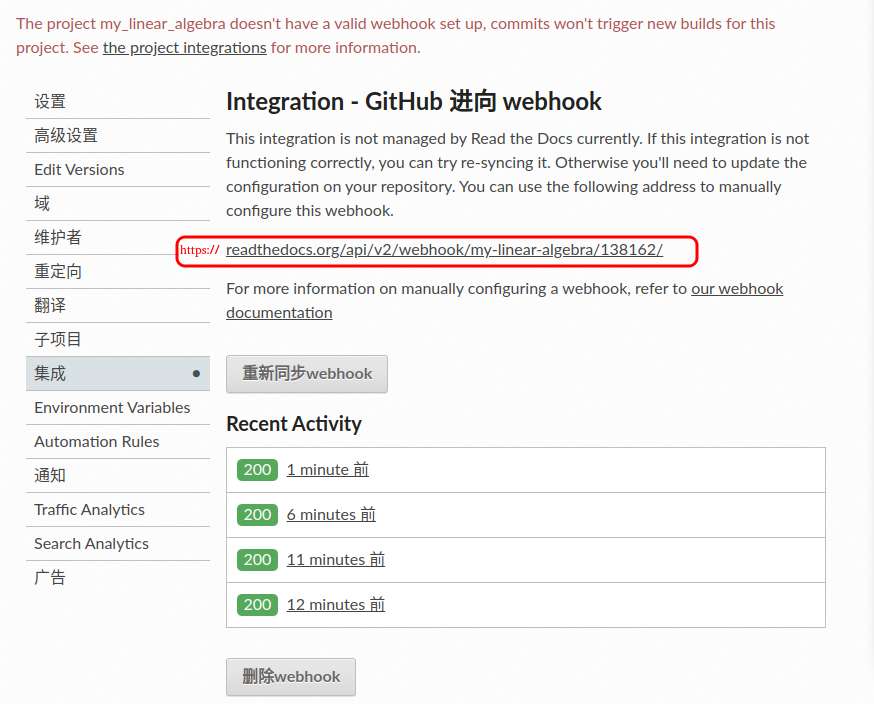

reStructuredText 
=====================

.. toctree::
   :maxdepth: 1
   :caption: Contents:

   conf
   chinese_search
   local_pdf
   graphviz
  

在线编辑器
    * http://rst.ninjs.org/
    * https://livesphinx.herokuapp.com/

参考文档
----------

* `reStructuredText 语法 <https://3vshej.cn/rstSyntax/index.html>`_

* `Quick reStructuredText <http://docutils.sourceforge.net/docs/user/rst/quickref.html>`_
* `reStructuredText Directives <http://docutils.sourceforge.net/docs/ref/rst/directives.html>`_
* `reStructuredText Markup Specification <http://docutils.sourceforge.net/docs/ref/rst/restructuredtext.html>`_
* `A ReStructuredText Primer <http://docutils.sourceforge.net/docs/user/rst/quickstart.html>`_
* `sphinx-doc <http://www.sphinx-doc.org/en/stable/index.html>`_

* `放到git page <http://lucasbardella.com/blog/2010/02/hosting-your-sphinx-docs-in-github>`_

* `sphinx文档规范与模版 <https://ebf-contribute-guide.readthedocs.io/zh_CN/latest/>`_

config-file
-------------------

* `https://docs.readthedocs.io/en/stable/config-file/v2.html#`

INSTALL
-------

.. code-block:: sh

    $ sudo pip install --upgrade pip -i https://pypi.mirrors.ustc.edu.cn/simple

    # for mac
    $ sudo pip install six --upgrade --ignore-installed six 

    $ sudo pip install sphinx==1.5.5  sphinx-autobuild==0.6.0 -i https://pypi.mirrors.ustc.edu.cn/simple
    $ sudo pip install sphinx_rtd_theme==0.2.4  -i https://pypi.mirrors.ustc.edu.cn/simple
    $ sudo python -m pip install m2r  # 支持Markdown

    $ sudo  apt-get install graphviz # suport  graphviz
    
* `Pip安装依赖于six的库失败的解决方法 <https://www.jianshu.com/p/45fb07007ddc>`_

theming
-----------

* `HTML <https://www.sphinx-doc.org/en/master/usage/theming.html>`_
* `sphinx-themes  <https://sphinx-themes.org/>`_

latex
--------------

.. code-block:: sh

    # 然后安装构建 PDF 所需的 TeX Live 相关包。
    sudo apt -y install texlive-xetex \
                        texlive-latex-recommended \
                        texlive-latex-extra \
                        texlive-fonts-recommended \
                        texlive-fonts-extra \
                        texlive-lang-english \
                        texlive-lang-chinese \
                        texlive-lang-cjk \
                        latexmk

    # 然后安装构建 texlive 所有包。
    sudo apt -y install texlive-full

    make latexpdf

*  svg 图片转pdf

.. code-block:: sh

  sudo apt-get install inkscape python3-sphinxcontrib.svg2pdfconverter

  # pip3 install  sphinxcontrib-svg2pdfconverter==1.2.0

.. code-block:: python

    extensions = [
        # ... ,
        # ... ,
        'sphinxcontrib.inkscapeconverter'
    ]

-------------------

.. code-block:: python

    extensions = [
        'recommonmark',           # sport markdown
        'sphinx_markdown_tables', # sport markdown tables 
        'sphinx_math_dollar',     # sport math
        'sphinx.ext.mathjax',     # sport math
        'sphinxcontrib.inkscapeconverter' # svg convert to pdf
        ]

* xindy - index generator for structured documents like LaTeX or SGML

.. code-block:: bash

    sudo apt-get install xindy

建立sphinx工程
--------------

.. code-block:: sh

    $ sphinx-quickstart

    $ echo "build/" >> .gitignore

.. code-block:: sh

    > Separate source and build directories (y/n) [n]: y

修改 conf.py

.. code-block:: python

    language = "zh_CN"
    html_theme = 'sphinx_rtd_theme'

.. code-block:: sh

    # language = "zh_CN"
    sed -i "s/^language =.*$/language = 'zh_CN'/g" source/conf.py
    # html_theme = 'sphinx_rtd_theme'
    sed -i "s/^html_theme =.*$/html_theme = 'sphinx_rtd_theme'/g" source/conf.py

    ## 手动注释掉,关闭: loading intersphinx inventory from https://docs.python.org/objects.inv...
    # intersphinx_mapping = {'https://docs.python.org/': None}

.. image:: img/github.png
       :height: 500 px
       :width: 800 px
       :scale: 100%
       :alt: alternate text
       :align: center

代码
----------

* `使用Sphinx,显示代码 <https://build-me-the-docs-please.readthedocs.io/en/latest/Using_Sphinx/ShowingCodeExamplesInSphinx.html>`_

* `Showing code examples <http://www.sphinx-doc.org/en/stable/markup/code.html#directive-highlight>`_

* `highlighting language  <http://pygments.org/docs/lexers/>`_

* `code-block 支持的代码格式 <http://pygments.org/docs/lexers/>`_

.. code-block:: rst

        .. code-block:: sh

                #!/bin/sh
                echo "hello world"

.. code-block:: rst

    .. literalinclude:: filename
       :linenos:
       :language:
       :lines:
       :start-after:
       :end-before:
       :emphasize-lines:

表格
------

.. code-block:: rst

    .. csv-table::
    :header: A, B, A and B
    :widths: 5, 10, 5

    False, False, False
    True, False, False
    False, True, False
    True, True, True

    .. csv-table:: Table Title
    :file: ./csv/name.csv
    :widths: 30, 70
    :header-rows: 1

标题
------

* `sections <https://docutils.sourceforge.io/docs/ref/rst/restructuredtext.html#sections>`_

+------+-------+
| 级别 | 标题  |
+======+=======+
| 01   | **=** |
+------+-------+
| 02   | **-** |
+------+-------+
| 03   | **`** |
+------+-------+
| 04   | **:** |
+------+-------+
| 05   | **'** |
+------+-------+
| 06   | **"** |
+------+-------+
| 07   | **~** |
+------+-------+
| 08   | **^** |
+------+-------+
| 09   | **_** |
+------+-------+
| 10   | `*`   |
+------+-------+
| 11   | **+** |
+------+-------+
| 12   | **#** |
+------+-------+
| 13   | **<** |
+------+-------+
| 14   | **>** |
+------+-------+

* `行内标记 <https://iridescent.ink/HowToMakeDocs/Basic/reST.html#inline-markup>`_
* `侧边栏 (Sidebar) <https://iridescent.ink/HowToMakeDocs/Basic/reST.html#sidebar>`_
* `脚注 <https://iridescent.ink/HowToMakeDocs/Basic/reST.html#footnotes>`_
* `引文 <https://iridescent.ink/HowToMakeDocs/Basic/reST.html#citations>`_

图片
-------------

.. code-block:: rst

        .. image:: ./images/pic1.png
                :scale: 60%

        .. image:: ./images/pic2.png
                :width:  380px
                :height: 253px

        .. image:: ./x.gif
               :height: 660px
               :width: 580 px
               :scale: 70%
               :alt: alternate text
               :align: center

        .. raw:: html

           

        .. raw:: html
           :url: http://docutils.sourceforge.net/docs/ref/rst/directives.html

公式
-------------

* `希腊字母表 <https://www.overleaf.com/learn/latex/List_of_Greek_letters_and_math_symbols>`_

.. φ -> \varphi
.. δ -> \delta

.. code-block:: rst

    $\acute{X_r}$  

    .. math::

    v_r=\acute{X_r}  cos \varphi +\acute{Y_r}sin\varphi

    $$
    \acute{X_f}cos( \varphi + \delta_f)−\acute{Y_f}sin( \varphi +  \delta_f)=0
    $$

    $$
    \acute{X_r}​sin\varphi − \acute{Y_r} cos\varphi=0
    $$

    .. math::

    \acute{X_r} = \acute{Y_r} {sin\varphi \over cos\varphi}​	

    .. math::

    v_r = \acute{Y_r}{sin\varphi \over cos\varphi}cos\varphi + \acute{Y_r}sin\varphi 
        = {{\acute{Y_r}cos\varphi^2+\acute{Y_r}sin\varphi^2} \over sin\varphi } 
        = sin\varphi \acute{Y_r}

    X_f = X_r + lcos\varphi 

    .. math:: 

    R = { v_r \over \omega } 

    .. math:: 
    
    \delta_f = arctan( {\omega l \over v_r} ) = arctan ( {l \over R} )

    .. math:: 

    \delta_f = arctan({l \over R})

    $$\gamma = {1 \over r} ={2x \over l^2}$$

    $$\delta_f =arctan({l \gamma} )$$

    $$= {{(a∆_x)^2 + (b∆_y)^2 + (a∆_y)^2 + (b∆_x)^2} \over {( a^2 + b^2)}}$$

    .. math:: 

    d = {{ | a x_0 + b y_0 + c | } \over { \sqrt{ a^2 + b^2} }}

`支持Markdown <https://github.com/miyakogi/m2r>`_
--------------------------------------------------

修改页面宽度 
--------------------------------------------------

* `参考 <https://stackoverflow.com/questions/23211695/modifying-content-width-of-the-sphinx-theme-read-the-docs>`_

Another option is to create a stylesheet in source/_static with just the css you want, e.g.

.. code-block:: css

    .wy-nav-content {
        max-width: none;
    }

    /*or*/

    .wy-nav-content {
        max-width: 1200px !important;
    }

Make sure the directory is referenced in source/conf.py - I believe by default there's a line to do this, i.e.

.. code-block:: python

    # Add any paths that contain custom static files (such as style sheets) here,
    # relative to this directory. They are copied after the builtin static files,
    # so a file named "default.css" will overwrite the builtin "default.css".

    html_static_path = ['_static']

Then create a custom layout in source/_templates/layout.html and do something like this to include your stylesheet

.. code-block:: html

    
    
        <link href="{{ pathto("_static/style.css", True) }}" rel="stylesheet" type="text/css">
    
    Assuming you called your stylesheet style.css

ReadTheDocs 私有部署搭建安装
----------------------------

.. literalinclude:: ./rtd_local_install.sh
    :language: bash
    :encoding: utf-8

