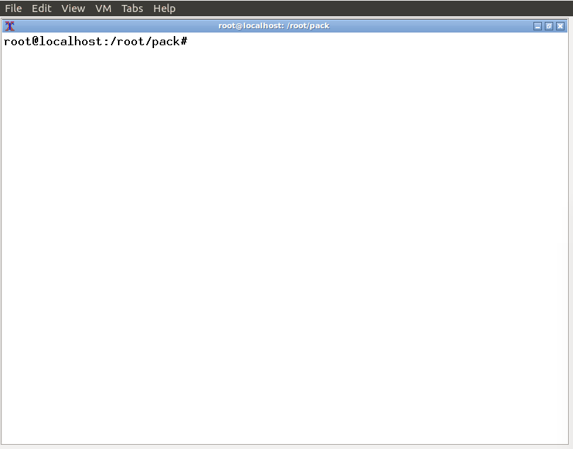
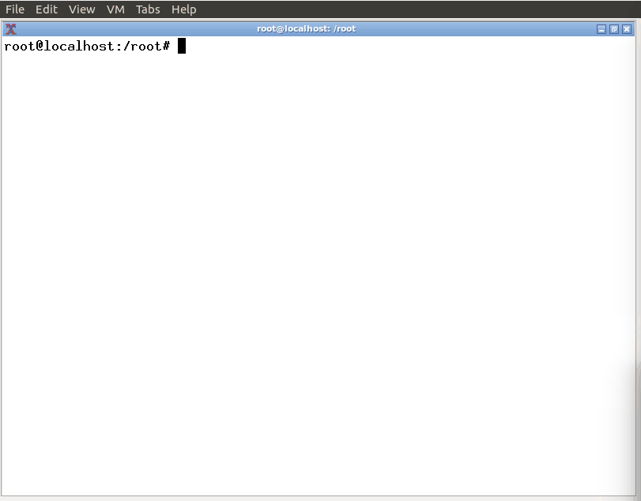

#######
openbox
#######

安装chrominum-browser和googlepinyin
-----------------------------------

1. Install
^^^^^^^^^^^^^^^^^^

主要安装如下几个包，以及其所依赖的包。

* adobe-flashplugin
* chromium-browser 
* ibus
* ibus-gtk
* ibus-gtk3
* ibus-pinyin
* ibus-googlepinyin
* ibus-clutter
* im-config
* dbus-x11

.. code:: sh

   $ sudo tar xzvf  chrome_and_pinyin.tgz 
   $ sudo cd  pack
   $ sudo dpkg -i *.deb
    

.. image:: ./images/install_deb.gif
       :scale: 100%
       :alt: alternate text
       :align: center

2. Config
^^^^^^^^^^^

.. code:: sh

   $ ibus  engine  googlepinyin 

3. How to use
^^^^^^^^^^^^^^

.. code:: sh

    $ chromium-browser --user-data-dir=/tmp www.baidu.com

