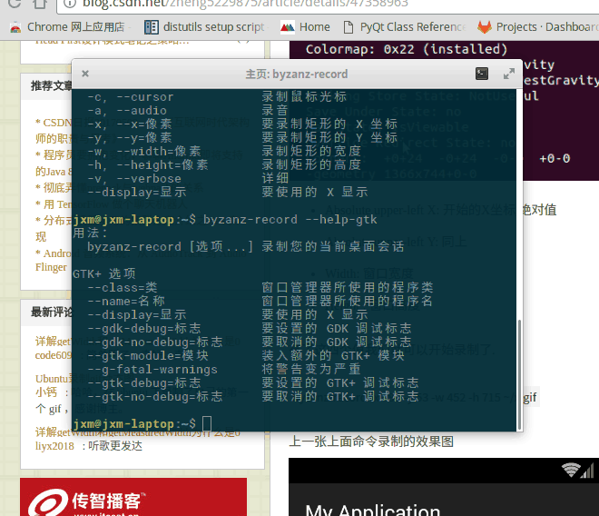

其他
================

other
--------------

* `快速建立工程模板cookiecutter <https://pypi.python.org/pypi/cookiecutter/1.5.1>`_
* `virtualenv搭建虚拟环境 <http://www.cnblogs.com/kym/archive/2011/12/29/2306428.html>`_

屏幕录像gif
---------------

* `LICEcap(支持Windows Mac) <http://www.cockos.com/licecap/>`_
* `byzanz-gui(支持Linux) <https://git.oschina.net/mc_space/byzanz-gui>`_

检查端口通不通
----------------

Linux
^^^^^^^^^^

#. python 检查端口通不通

    .. code-block:: python

        #!/usr/bin/env python
        #coding=utf8

        ip = '192.168.5.204'
        port  = 5900

        import socket
         
        sk = socket.socket(socket.AF_INET, socket.SOCK_STREAM)
         
        sk.settimeout(1)
         
        try:
            sk.connect((ip,port))
            print 'Server %s:%s  OK!' % (ip,port)
        except Exception:
            print 'Server %s:%s not connect!' % (ip,port) 
        sk.close()

#. nc命令检查端口

    .. code-block:: sh

        $ nc  -vz 192.168.5.204 5904

#. telnet 命令检查端口
    
    .. code-block:: sh

        $ telnet 192.168.5.204 5900 

CenterOS
------------

#. 检查某服务是否开机启动

    .. code-block:: sh

            # chkconfig dnsmasq 
	

#. 开启/禁止 某服务开机启动

    .. code-block:: sh

            # chkconfig dnsmasq on/off
            # systemctl enable/disable  dnsmasq 
	

#. 启动/停止/重启 某服务

    .. code-block:: sh

            # systemctl start/stop/restart dnsmasq 
	

