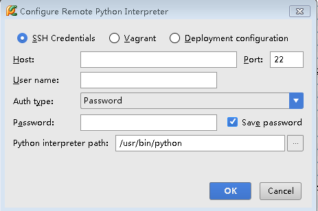
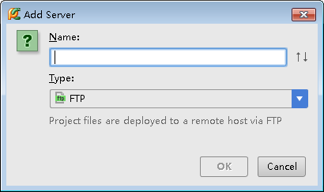
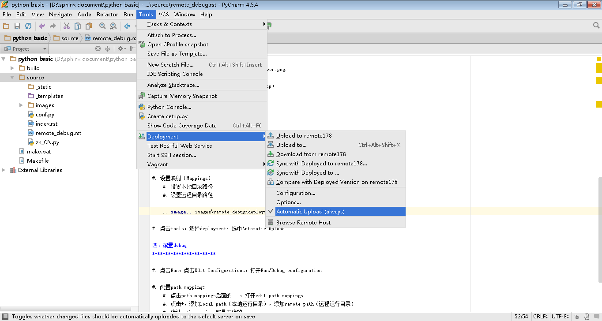
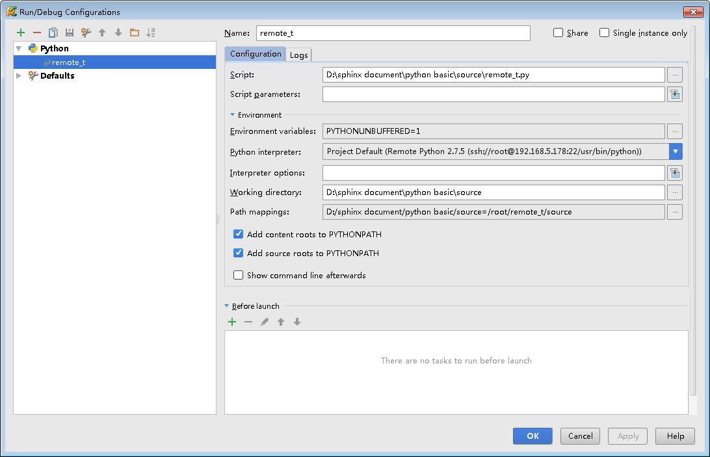

====================
远程开发和调试
====================

一、安装pycharm-debug.egg
******************************

#. 在pycharm安装目录\PyCharm 4.5.4\debug-eggs下找到pycharm-debug.egg

#. 将pycharm-debug.egg安装到远程主机上（easy_install安装）

二、配置远程解释器
*********************

.. image:: ./images/remote_debug/setting_project_interpreter.PNG
        :scale: 60%

#. 如有必要，修改Python解释器路径。

#. 点击右上角齿轮，选择添加远程解释器。

#. 选中ssh credentials，填写host（IP），远程主机用户名和对应的密码。如有必要，修改Python解释器路径。

#. 填写好后，点击OK。

三、配置部署
********************

#. 点击tools，选择deployment，点击configuration..

.. image:: ./images/remote_debug/config_deployment.png
        :scale: 45%

.. image:: ./images/remote_debug/deployment_connection.png
        :scale: 70%

#. 在deployment界面，点击+，弹出add server界面

#. 输入服务端的名字，选择传输协议（可以是sftp）

#. 设置连接
    #. host 填写主机IP
    #. 端口
    #. root path
    #. user name
    #. password

.. image:: ./images/remote_debug/deployment_connection.png
        :scale: 70%

#. 设置映射（Mappings）
    #. 设置本地目录路径
    #. 设置远程目录路径

.. image:: ./images/remote_debug/deployment_mapping.png
        :scale: 70%

#. 点击tools，选择deployment，选中Automatic Upload

四、配置debug
************************

#. 点击Run，点击Edit Configurations，打开Run/Debug configuration

.. image:: ./images/remote_debug/config_run_debug.png
        :scale: 45%

#. 配置path mapping：
    #. 点击path mappings后面的...，打开edit path mappings
    #. 点击+，添加local path（本地运行目录），添加remote path（远程运行目录）
    #. 确认path mappings都是正确的

