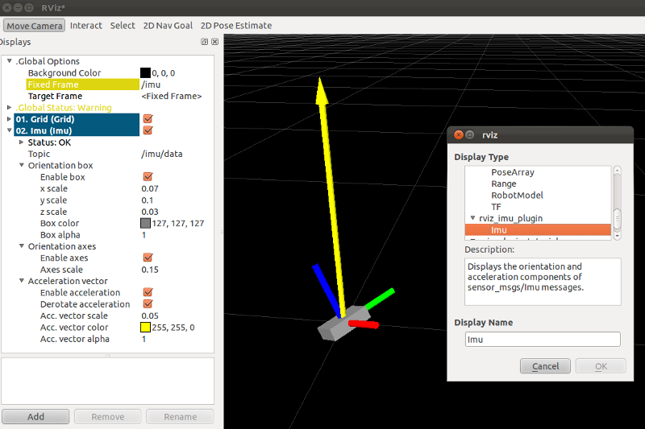
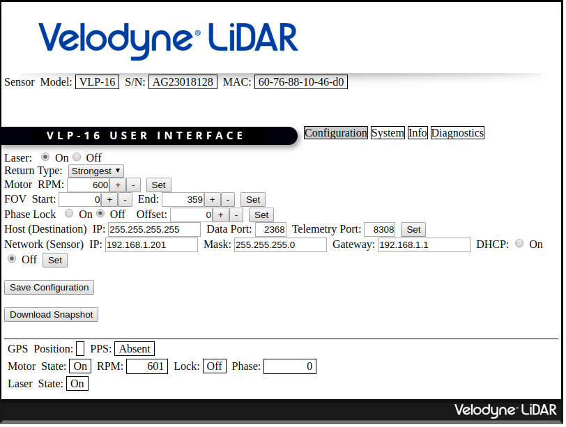
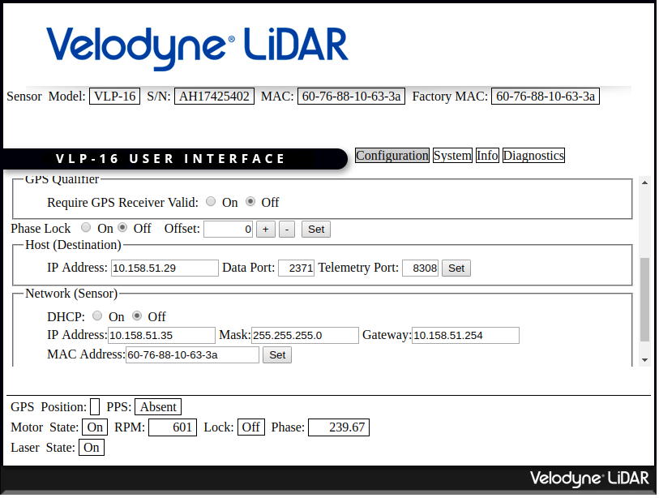

#############
ROS
#############

* PlotJuggler

.. code-block:: sh

    apt-get install ros-melodic-plotjuggler ros-melodic-plotjuggler-ros

* 待研究
    * `ros 开机自启动 `robot_upstart`
    * `解决ROS系统 rosdep update超时问题的新方法 <https://blog.csdn.net/leida_wt/article/details/115120940>`_

    * `ros-plugin <https://github.com/huchunxu/ros_exploring/tree/master/ros_advanced/pluginlib_tutorials>`_
    * `ros-dynamic <https://github.com/huchunxu/ros_exploring/tree/master/ros_advanced/dynamic_tutorials>`_

    .. code-block:: sh

        wget -qO - https://github.com/my-rds-store/my_space/raw/master/source/ros/shell/rosdep_repair.sh | bash
        wget -qO - https://raw.fastgit.org/my-rds-store/my_space/master/source/ros/shell/rosdep_repair.sh | bash

  .. literalinclude:: ./shell/rosdep_repair.sh
     :language: bash

* `Awesome Robotic Tooling <https://freerobotics.tools/>`_
    * https://freerobotics.tools/#communication-and-coordination
    * https://freerobotics.tools/#documentation-and-presentation
    * https://freerobotics.tools/#requirements-and-safety
    * https://freerobotics.tools/#architecture-and-design
    * https://freerobotics.tools/#frameworks-and-stacks
    * https://freerobotics.tools/#development-environment
    * https://freerobotics.tools/#template
    * https://freerobotics.tools/#build-and-deploy
    * https://freerobotics.tools/#unit-and-integration-test
    * https://freerobotics.tools/#lint-and-format
    * https://freerobotics.tools/#debugging-and-tracing
    * https://freerobotics.tools/#version-control
    * https://freerobotics.tools/#simulation
    * https://freerobotics.tools/#electronics-and-mechanics
    * https://freerobotics.tools/#sensor-processing
    * https://freerobotics.tools/#perception-pipeline
    * https://freerobotics.tools/#machine-learning
    * https://freerobotics.tools/#parallel-processing
    * https://freerobotics.tools/#image-processing
    * https://freerobotics.tools/#radar-processing 
    * https://freerobotics.tools/#lidar-and-point-cloud-processing 
    * https://freerobotics.tools/#localization-and-state-estimation
    * https://freerobotics.tools/#simultaneous-localization-and-mapping 
    * https://freerobotics.tools/#visual
    * https://freerobotics.tools/#vector-map 
    * https://freerobotics.tools/#prediction
    * `behavior-and-decision <https://freerobotics.tools/#behavior-and-decision>`_
    * `planning and control <https://freerobotics.tools/#planning-and-control>`_
        * `steering_functions` - Contains a C++ library that implements steering functions for car-like robots with limited turning radius.
    * https://freerobotics.tools/#user-interaction
    * https://freerobotics.tools/#acoustic-user-interface 
    * https://freerobotics.tools/#command-line-interface
    * https://freerobotics.tools/#data-visualization-and-mission-control 
    * https://freerobotics.tools/#annotation
    * https://freerobotics.tools/#point-cloud
    * https://freerobotics.tools/#rviz
    * https://freerobotics.tools/#operation-system
    * https://freerobotics.tools/#database-and-record
    * https://freerobotics.tools/#network-distributed-file-system
    * https://freerobotics.tools/#server-infrastructure-and-high-performance-computing
    * https://freerobotics.tools/#embedded-operation-system
    * https://freerobotics.tools/#real-time-kernel
    * https://freerobotics.tools/#network-and-middleware
    * https://freerobotics.tools/#ethernet-and-wireless-networking
    * https://freerobotics.tools/#controller-area-network
    * https://freerobotics.tools/#sensor-and-acuator-interfaces
    * https://freerobotics.tools/#security
    * https://freerobotics.tools/#datasets

* `Webots <https://cyberbotics.com/#cyberbotics>`_
    * `webots-超详细入门教程(2020) <https://www.bilibili.com/video/BV11V411f7ko?p=2&spm_id_from=pageDriver>`_
    * `ROS仿真平台总结 <https://rupingcen.blog.csdn.net/article/details/106396478>`_
        * `Webots 机器人仿真平台(一) 系统安装 <https://rupingcen.blog.csdn.net/article/details/105122098>`_ 
        * Webots 机器人仿真平台(八) 添加GPS传感器 https://rupingcen.blog.csdn.net/article/details/105658021
        * Webots 机器人仿真平台(九) 添加IMU传感器 https://blog.csdn.net/crp997576280/article/details/105667450
        * Webots 机器人仿真平台(十一) 添加激光传感器（laser） <https://rupingcen.blog.csdn.net/article/details/105761752>

    * `webots 自动驾驶 <https://cyberbotics.com/doc/automobile/introduction>`_

----

* `开源自主导航小车MickX4（十）总结 <https://rupingcen.blog.csdn.net/article/details/113438074>`_
    * `源自主导航小车MickX4（七）cartographer 室外3D建图 <https://blog.csdn.net/crp997576280/article/details/111600534>`_
    * `开源自主导航小车MickX4（八）LeGo-LOAM 室外3D建图 <https://blog.csdn.net/crp997576280/article/details/111657554>`_
    *  `开源自主导航小车MickX4（九）基于move_base 的自主导航框架 <https://blog.csdn.net/crp997576280/article/details/113434795>`_

-----

* `ROS与QT语言入门教程 <https://www.ncnynl.com/category/ros-qt/>`_

* `rospy [阅读中...] <https://www.ncnynl.com/archives/201611/1055.html>`_
* `roscpp <https://www.ncnynl.com/archives/201701/1273.html>`_

* `ROS探索总结 <http://www.guyuehome.com/column/ros-explore/page/3>`_

------

* `ROS与javascript入门教程 <https://www.ncnynl.com/archives/201709/2124.html>`_
    * `ros2djs-api <http://robotwebtools.org/jsdoc/ros2djs/current/index.html>`_
    * `ros3djs-api <http://robotwebtools.org/jsdoc/ros3djs/current/index.html>`_

------

* ros Pluginlib
    * `ROS Pluginlib基础篇 <https://zhuanlan.zhihu.com/p/100562982>`_
    * `ROS Pluginlib高级篇 <https://zhuanlan.zhihu.com/p/101107305>`_
    * `ROS Nodelet介绍  <https://zhuanlan.zhihu.com/p/103032444>`_

* https://github.com/chengyangkj/Ros_Qt5_Gui_App#%E5%AE%89%E8%A3%85%E6%95%99%E7%A8%8B

------

* `中国大学MOOC---《机器人操作系统入门》课程讲义 <https://sychaichangkun.gitbooks.io/ros-tutorial-icourse163/content/>`_
    * `课程讲义 github markdown file  <https://github.com/DroidAITech/ROS-Academy-for-Beginners-Book-Melodic>`_

    * `代码示例 <https://github.com/DroidAITech/ROS-Academy-for-Beginners>`_

* `CSDN ROS学习八篇 <https://blog.csdn.net/tansir94/category_7885264.html>`_

***********
URDF
***********

* https://www.cnblogs.com/linuxAndMcu/p/10869157.html
* https://www.cnblogs.com/linuxAndMcu/p/10874789.html
* https://www.cnblogs.com/linuxAndMcu/p/10876005.html

***********
example
***********

* `ROS with PyQt <https://github.com/WelinLee/ROS_QT_GUI.git>`_

***********
环境搭建
***********

.. code-block:: sh

        # 更换阿里源
        sed -i 's/cn.archive.ubuntu.com/mirrors.aliyun.com/' /etc/apt/sources.list
        sed -i 's/archive.ubuntu.com/mirrors.aliyun.com/' /etc/apt/sources.list
        sed -i 's/ports.ubuntu.com/mirrors.aliyun.com/' /etc/apt/sources.list # arm

        #  添加 ROS源
        sudo sh -c '. /etc/lsb-release && echo "deb http://mirrors.ustc.edu.cn/ros/ubuntu/ $DISTRIB_CODENAME main" > /etc/apt/sources.list.d/ros-latest.list'

        sudo apt-key adv --keyserver keyserver.ubuntu.com --recv-keys F42ED6FBAB17C654
        sudo apt-get update

        #apt-cache search ros-kinetic
        sudo apt-get install ros-melodic-desktop-full --yes --allow-unauthenticated

        # sudo apt-get install ros-kinetic-slam-gmapping -y # 地图建模

        sudo rosdep init
        rosdep update
        sudo apt-get install python-rosinstall \
                             python-rosinstall-generator \
                             python-wstool \
                             build-essential --yes --allow-unauthenticated
        source /opt/ros/kinetic/setup.sh

        ########################################
        # install  ros melodic  on ubuntu 18.04  
        ########################################
        sudo sh -c '. /etc/lsb-release && echo "deb http://mirrors.ustc.edu.cn/ros/ubuntu/ $DISTRIB_CODENAME main" > /etc/apt/sources.list.d/ros-latest.list'
        rosdep update

        sudo apt install ros-melodic-desktop-full
        # sudo apt-get install rosbash 
        # sudo apt-get install ros-melodic-rosbash ros-melodic-rosbash-params # install and reboot , roscd 
        sudo apt-get install ros-${ROS_DISTRO}-rosbash ros-${ROS_DISTRO}-rosbash-params

        apt-cache search ros-melodic

.. code-block:: sh

        # 小乌龟
        source /opt/ros/melodic/setup.sh
        rosrun turtlesim turtlesim_node
        rosrun turtlesim turtle_teleop_key

* `《ROS机器人开发实践》源码 <https://github.com/huchunxu/ros_exploring>`_

* `LIO-SAM <https://github.com/TixiaoShan/LIO-SAM>`_
    * `LIO-SAM运行自己数据包遇到的问题解决--SLAM不学无数术小问题 <https://blog.csdn.net/weixin_42141088/article/details/118000544>`_
    * `LIO-SAM源码阅读分析（1）--配置文件Tips <https://zhuanlan.zhihu.com/p/171589473>`_
    * https://zhuanlan.zhihu.com/p/352039509
    * https://blog.csdn.net/heirenlop/article/details/115216476
* `imu ch110 <https://hub.fastgit.org/hipnuc/products>`_

***********
常用命令
***********

.. code-block:: sh
        
        roscore

        rqt_graph   #  查看节点关系

        echo $ROS_PACKAGE_PATH

        catkin_init_workspace

        catkin_create_pkg <package_name> [depend1] [depend2] ... [dependn]
        #catkin_create_pkg learning_communication std_msgs rospy roscpp
        catkin_make
        
        ## 只编译白名单
        catkin_make -DCATKIN_WHITELIST_PACKAGES="ros_pyqt;pyqt_gui;rqt_gui"
        ## 不编译,黑名单列表里面的包
        catkin_make -DCATKIN_BLACKLIST_PACKAGES="dyn_cfg_gui;qt_ros_test;ros_cmake;qt4rosgui;test_gui;vizlib_test;rqt_mypkg;ros_cv_gui"

        rosrun [package_name] [node_name]
        
rosnode
========

.. code-block:: sh

        rosnode list                # 获得运行节点列表
        rosnode info node-name      # 获得特定节点的信息
        rosnode ping node-name      # 测试节点是否连通
        rosnode kill node-name      # 终止节点

rospack
========

.. code-block:: sh

    rospack -h

rosparam
==========

.. code-block:: sh

    rosparam set     set parameter             设置参数
    rosparam get     get parameter             获得参数值
    rosparam load    load parameters from file 从文件中加载参数到参数服务器
    rosparam dump    dump parameters to file   将参数服务器中的参数写入到文件
    rosparam delete  delete parameter          删除参数
    rosparam list    list parameter names      列出参数服务器中的参数

rostopic
========

.. code-block:: sh

        rostopic -h
        
        rostopic type /sent_messages
        rosmsg info can_msgs/Frame

        #                           src topic   =>    des topic
        rosrun topic_tools relay /cv_camera/image_raw /camera/image_raw

        rostopic pub /chatter std_msgs/String  'hello'  # 发一次
        rostopic pub /chatter std_msgs/String -r 1 -- '{data: hello}' # 一秒发一次

        rostopic pub  /sent_messages can_msgs/Frame  -r 1 -- \
       '{header: auto,id: 15, is_rtr: 0,is_extended: 0,is_error: 0,dlc: 8,data: [1,2,3,4,5,6,7,9]}'

roslaunch
=============

.. code::

    一 node标签

        在<node>标签指定一个ROS 节点，这是最常见的roslaunch标签, 因为它支持最重要的功能: 启动和关闭节点。

        roslaunch不保证节点开始的顺序。
        因为没有办法从外部知道节点何时被完全初始化,所以所有被启动的节点必须是稳健的，以便以任何顺序启动。

    二 示例

        <node name ="listener1" pkg ="rospy_tutorials" type ="listener.py" args =" -  test" respawn ="true"/>
            启动"listener1" 节点，使用listener.py从可执行rospy_tutorials 包与所述命令行参数--test。
            如果节点死亡，它将自动重新生成。

        <node name ="bar1" pkg ="foo_pkg" type ="bar" args ="$(find baz_pkg)/resources/map.pgm"/>
            从foo_pkg包中启动bar1节点。此示例使用替换参数将可移植引用传递到 baz_pkg/resources/map.pgm . 

    三 属性

        pkg ="mypackage" 节点包。
        type ="nodetype" 
            节点类型。必须有一个具有相同名称的相应可执行文件。
        name ="nodename"
            节点基名称。注意：name不能包含命名空间。请改用ns属性。

        args ="arg1 arg2 arg3" （可选） 
            传递参数到节点。
        machine =“machine-name” （可选）
            在指定机器上启动节点。

        respawn ="true" （可选）
            如果节点退出，则自动重新启动节点。
        respawn_delay ="30" （可选，默认为0）ROS indigo中的新功能
            如果respawn为true，请在尝试重新启动之前检测到节点故障后等待respawn_delay秒。

        required = "true" （可选）
            ROS 0.10：如果节点死亡，杀死整个roslaunch。

        ns ="foo" （可选）
            在"foo"命名空间中启动节点。
        clear_params ="true | false" （可选）
            在启动前删除节点的私有命名空间中的所有参数。
        output =“log | screen” （可选）

            如果'screen'，stdout / stderr从节点将被发送到屏幕。
            如果是“log”，stdout / stderr输出将被发送到 $ROS_HOME/log中的日志文件，
            stderr将继续发送到屏幕。默认值为“log”。
        cwd =“ROS_HOME | node” （可选）
            如果为“node”，则节点的工作目录将设置为与节点的可执行文件相同的目录。
            在C Turtle中，默认值为“ROS_HOME”。在Box Turtle（ROS 1.0.x）中，默认值是'ros-root'。
            使用'ros-root'在C Turtle中已被弃用。

        launch-prefix ="prefix arguments" （可选）

            用于预先添加到节点的启动参数的命令/参数。
            这是一个强大的功能，使您能够启用gdb，valgrind，xterm，漂亮或其他方便的工具。

    四 元素

        您可以在<node>标记中使用以下XML 标签：

        <env>
            为节点设置环境变量。

        <remap>
            为此节点设置重新映射参数。
            <remap from="/original_name" to="/new_name"/>

        <rosparam>
            将rosparam文件加载到此节点的〜 / local命名空间中。

            <rosparam file="$(find 2dnav_pr2)/config/costmap_common_params.yaml" 
                    command="load" ns="local_costmap" />

        <param>
            在节点的〜 / local命名空间中设置一个参数。

`rosbag <http://wiki.ros.org/rosbag/Commandline>`_
====================================================

* `Commandline <http://wiki.ros.org/rosbag/Commandline>`_
* `Code API <http://wiki.ros.org/rosbag/Code%20API>`_

* 录制

.. code-block:: sh

        rosbag -h

        rosbag record -a
        rosbag record /topic_name1 /topic_name2 /topic_name3
        rosbag record -O/-o filename.bag /topic_name1 #  -O (大写) 后跟录制数据包的名字。
                                                      #  -o（小写）则只是给数据包的名字加前缀。
                                                      
        rosbag record -a -O filename.bag -x "/monitor/(.*)" #记录过滤掉/monitor/*之外的其他topic

        # 在运行rosbag record命令的窗口中按Ctrl-C退出该命令，即结束数据记录。

        # 现在在~/bagfiles目录中应该会看到一个以日期和时间命名并以.bag作为后缀的 rosbag 文件，
        # 它包含rosbag record运行期间发布的 topic。

如果在 launch 文件中使用 rosbag record 命令，如下

.. code-block:: xml

    <node pkg="rosbag" type="record" name="bag_record" args="/topic1 /topic2"/> 

默认存放路径是 ~/.ros 中。

.. code-block:: sh

    rosbag info filename.bag

* 回放

.. code-block:: sh

    rosparam set /use_sim_time true # 使用的是仿真时间
    
    # launch文件 设置
    # <param name="use_sim_time" value="false" />
    

    rosbag play <bagfile>
    rosbag play ros.bag  /original_name:=/new_name  # rosbag remap topoic name
    rosbag play -r 2 <bagfile> # 两倍的速度发布topic。 -r 后面的数字对应播放速率。
    rosbag play -l  <bagfile>  # -l == --loop  循环播放
    rosbag play <bagfile> --topics /topic1  # 只播放感兴趣的 topic
    rosbag play <bagfile> -d <sec> # 等待一定时间之后发布bag文件中的内容 ;  rosbag  help play  | grep delay

    # 在上述播放命令执行期间，空格键可以暂停播放。

* 过滤

.. code-block:: sh

    rosbag filter IN.bag OUT.bag 'topic == "/turtle1/command_velocity"'
    rosbag filter skoda.bag skoda_filter.bag  "topic == '/BrakeCmd' or topic == '/SteeringCmd' or topic == '/ThrottleCmd' or topic== '/rosout' or topic=='/rosout_agg'"

* 压缩 compress

.. code-block:: sh

    # 有时候我们的包太大了，会导致打开很慢。比如25G的KITTI数据包可能需要10分钟打开。
    # rosbag提供了两种压缩格式：BZ2和LZ4。
    # 其中BZ2占用硬盘小，但播放慢。LZ4虽然对体积的压缩不多，但打开速度提高了数倍。
    # 另外，此命令会自动备份要压缩的数据包，命名会加一个origin，所以无需担心。

    rosbag compress --lz4 slam_2019-12-14-23-24-43_filter.bag

————————————————

原文链接：https://blog.csdn.net/a850565178/article/details/105820624

rosdep
========
    
.. code-block:: sh

        rosdep install AMAZING_PACKAGE
        rosdep install --from-paths src --ignore-src -r -y # 用于安装工作空间中所有包的依赖项

* rosdep update一直timeout的问题  !

.. code-block:: sh
    
    find  /usr/lib/python2.7/dist-packages/rosdep2/ -name "*.py" | xargs grep -n  "DOWNLOAD_TIMEOUT\ ="

    #  将  DOWNLOAD_TIMEOUT = 15.0 的值，改大一点就可以了

***************
知识点
***************

CATKIN_IGNORE
==============

.. code-block:: sh

    touch /path/to/catkin_ws/your/package/CATKIN_IGNORE

ROSINFO
==========

.. code-block:: sh

    export ROSCONSOLE_FORMAT='[${severity}] [${time}]${node}--${function}-${line}: ${message}'
    
    # ${line}     for __LINE__
    # ${function} for __func__
    # ${file}     for __FILE__
    # ${node}     for the node name, no pre-processor equivalent.

package
==========

* `image_transport <http://wiki.ros.org/image_transport>`_

    .. code-block:: sh

       # 解压缩
       # /cv_camera/image_raw/compressed  => /cv_camera/image_decompressed
       rosrun image_transport republish compressed in:=/cv_camera/image_raw \
                                                  out:=/cv_camera/image_decompressed

       # /simulator/camera_node/image/compressed  => /image_raw
       rosrun image_transport republish compressed in:=/simulator/camera_node/image \
                                                  out:=/cv_camera/image_decompressed

    .. code-block:: xml

        <launch>
            <node name="image_decompresser" type="republish" pkg="image_transport" output="screen" args="compressed in:=/simulator/camera_node/image raw out:=/image_raw">
            </node>
        </launch>

* `订阅 rtsp topic 发送 rtsp - ros_rtsp <https://github.com/CircusMonkey/ros_rtsp.git>`_

* `rocon_rtsp_camera_relay  <http://wiki.ros.org/action/fullsearch/rocon_rtsp_camera_relay?action=fullsearch&context=180&value=linkto%3A%22rocon_rtsp_camera_relay%22>`_  
    * `参考 - Ubuntu利用ROS搭建手机移动网络摄像头 (Android) <https://www.bbsmax.com/A/E35pOMWgJv/>`_

    .. code-block:: sh

        mkdir -p  work_dir/src
        cd  work_dir/src
        git clone  --depth 1 https://github.com/robotics-in-concert/rocon_devices.git
        cd ../
        catkin_make

        source devel/setup.zsh 

        # export ROCON_RTSP_CAMERA_RELAY_URL=rtsp://wowzaec2demo.streamlock.net/vod/mp4:BigBuckBunny_115k.mov # public rtsp test url
        export ROCON_RTSP_CAMERA_RELAY_URL=rtsp://192.168.2.100:5540/ch0
        roslaunch rocon_rtsp_camera_relay rtsp_camera_relay.launch --screen

        rosrun rqt_image_view rqt_image_view /rtsp_camera_relay/image

    * `VXG RTSP Server APK (IP camera) <https://apkpure.com/vxg-rtsp-server-ip-camera/veg.mediacapture.sdk.test.server>`_
        * `APK (需要登梯子) <https://apk.support/app/veg.mediacapture.sdk.test.server>`_

----------------

* `pointgrey_camera_driver <http://wiki.ros.org/pointgrey_camera_driver>`_

    `Download FlyCapture SDK - flycapture2-2.13.3.31-amd64-pkg_Ubuntu18.04.tgz <https://www.flir.com/support-center/iis/machine-vision/downloads/spinnaker-sdk-flycapture-and-firmware-download/>`_

.. code-block:: bash

    tar xzvf flycapture2-2.13.3.31-amd64-pkg_Ubuntu18.04.tgz
    cd flycapture2-2.13.3.31-amd64
    
    # README
    # Ubuntu 18.04:
    sudo apt-get install libraw1394-11 libavcodec57 libavformat57        \
        libswscale4 libswresample2 libavutil55 libgtkmm-2.4-1v5              \
        libglademm-2.4-1v5 libgtkglextmm-x11-1.2-0v5 libgtkmm-2.4-dev        \
        libglademm-2.4-dev libgtkglextmm-x11-1.2-dev libusb-1.0-0

    sudo bash install_flycapture.sh
    y
    y
    ${USER}
    y

   To do this just add "raw1394" to the /etc/modules file.
   # vim /etc/modules-load.d/modules.conf

   # 
   git clone --depth  1 https://github.com/ros-drivers/pointgrey_camera_driver.git
   source devel/setup.zsh 
   roslaunch pointgrey_camera_driver camera.launch

   rostopic list

-------------

rviz
========

.. code-block:: sh

    # imu
    sudo apt-get install ros-melodic-imu-tools

tf变换
==========================

.. image:: img/Yaw_Axis_Corrected.svg

* `什么是tf变换 <https://www.guyuehome.com/355>`_
    * `源码 github <https://github.com/ros-example/ros_explore/tree/master/robot_setup_tf>`_
* `坐标系统 <https://www.guyuehome.com/265>`_
* `重读tf <https://www.guyuehome.com/279>`_

.. code-block:: sh

    rosrun tf tf_monitor <source_frame> <target_target>
    rosrun tf tf_echo <source_frame> <target_target> 
    rosrun tf view_frames 

* `static_transform_publisher <https://blog.csdn.net/tiancailx/article/details/78910317>`_

.. code-block:: sh

    # << ROS机器人开发实践 >> Page 64
    rosrun tf static_transform_publisher x y z yaw pitch roll frame_id child_frame_id period_in_ms
    rosrun tf static_transform_publisher x y z qx  qy  qz  qw frame_id child_frame_id period_in_ms

.. code-block:: xml

    <!-- << ROS机器人开发实践 >> Page 64 -->
    <launch>
    <node pkg="tf" type="static_transform_publisher" name="world_to_map" args="0 0 0 0 0 0 /world /map 10" />
    <node pkg="tf" type="static_transform_publisher" name="map_to_mobility" args="0 0 0 0 0 0 /map /mobility 10" />
    </launch>

* `API <http://wiki.ros.org/tf/Overview/Using%20Published%20Transforms>`_

* `tf namespace <http://docs.ros.org/en/kinetic/api/tf/html/c++/namespacetf.html>`_
    * tf::TransformListener Class Reference

    +---------------------+-----------------------+-------------------------------+ 
    | cpp                 |  python               | type                          |
    +=====================+=======================+===============================+ 
    |transformQuaternion()| transformQuaternion() |geometry_msgs/QuaternionStamped|
    +---------------------+-----------------------+-------------------------------+ 
    |transformVector()    | transformVector3()    | geometry_msgs/Vector3Stamped  |
    +---------------------+-----------------------+-------------------------------+ 
    |transformPoint()     | transformPoint()      | geometry_msgs/PointStamped    |
    +---------------------+-----------------------+-------------------------------+ 
    |transformPose()      | transformPose()       | geometry_msgs/PoseStamped     |
    +---------------------+-----------------------+-------------------------------+ 
    |transformPointCloud()| transformPointCloud() | sensor_msgs/PointCloud        |
    +---------------------+-----------------------+-------------------------------+ 

    .. code-block:: cpp

         static geometry_msgs::Quaternion createQuaternionMsgFromRollPitchYaw (double roll, 
                                                                               double pitch, 
                                                                               double yaw)	

         void tf::Quaternion::setRPY(const tfScalar & 	roll,
                                     const tfScalar & 	pitch,
                                     const tfScalar & 	yaw)

        // 将 tf::Quaternion 转换成  geometry_msgs::Quaternion
        static void quaternionTFToMsg ( const Quaternion &bt, 
                                        geometry_msgs::Quaternion &msg)

* `geometry_msgs <http://docs.ros.org/en/api/geometry_msgs/html/index-msg.html>`_

ROS 分布式
==========================

* `两台机器、两个主机的ros通信配置和实验 <https://www.jianshu.com/p/872dc7b514f1?utm_campaign>`_

.. code:: 

    sudo apt-get install chrony # 时间同步

    export ROS_MASTER_URI=http://${MasterHostName}:11311

.. code:: 

    export ROS_HOSTNAME=192.168.1.102
    export ROS_IP=192.168.1.102
    export ROS_MASTER_URI=http://192.168.1.102:11311

    #
    export ROS_MASTER_URI=http://192.168.1.102:11311

https://www.jianshu.com/p/872dc7b514f1?utm_campaign

***************
创建Deb安装包
***************

* `How to make a debian from a ROS package <https://gist.github.com/awesomebytes/196eab972a94dd8fcdd69adfe3bd1152>`_

.. code-block:: sh

    sudo apt-get install python-bloom=0.10.2-100
    # or sudo pip install -U bloom

    #sudo apt-get install dpkg-dev debhelper
    sudo apt-get install fakeroot=1.22-2ubuntu1

.. code-block:: sh

    # 1. Create debian structure

    #    To make a debian folder structure from the ROS package 
    #    you must cd into the package to be in the same folder where package.xml file is.
    bloom-generate rosdebian --os-name ubuntu --os-version bionic --ros-distro melodic
    # bloom-generate rosdebian --ros-distro melodic
    
    # 2. Create binary debian
    fakeroot debian/rules binary

* `生成的deb安装包，依赖本地deb包 <https://answers.ros.org/question/280213/generate-deb-from-dependent-res-package-locally/#280235>`_。

    * 1. 创建文件 `rosdep.yaml`

    .. code:: yaml

        pm_gnss_msgs:
            ubuntu: ros-melodic-pm-gnss-msgs

    * 2. 在 `/etc/ros/rosdep/sources.list.d/50-my-packages.list` 编辑

    .. code:: 

        yaml file:///mnt/waypoint_follower/waypoint_follower_1.0/src/pure_pursuit_ext/rosdep.yaml

    * 3. 然后

    .. code:: 

        rosdep update                   # 更新本地
        rosdep db | grep  pm_gnss_msgs  # 查看

***************
sensor
***************

velodyne
========

 
::

    Motor RPM: 转速,范围(0-1200), 默认 600 

    Host(Destination)  
        - IP Address    : 广播地址 255.255.255.255
                        : 单播地址 接收端(UDP Server)设备 IP , eg: 10.158.51.29  
                          接收端设备IP，必须和此IP一致。

        - Data Port     : 网络端口 , default 2368

.. code-block:: sh

    roslaunch velodyne_pointcloud VLP16_points.launch port:=2368
    roslaunch velodyne_pointcloud VLP16_points.launch port:=2371

    # topic 
    #    - /velodyne_points
 

* `ROS创建点云数据并在rviz中显示 <https://blog.csdn.net/qq_43176116/article/details/88020003>`_

***************************
LIO-SAM
***************************

.. code-block:: bash

    docker pull daocloud.io/jiangxumin/lio_sam_utils:latest

    docker run --rm --name=lio_sam_utils  -it -v $(pwd):/root/host_dir daocloud.io/jiangxumin/lio_sam_utils:latest

    
* https://blog.csdn.net/weixin_42141088/article/details/118000544

***************
CAN BUS
***************

* `CAN BUS tools <https://cantools.readthedocs.io/en/latest/>`_

***********
Peak-CAN
***********

* `安装peak can Drivers <https://www.peak-system.com/Drivers.523.0.html?&L=1>`_
    * `peak-linux-driver-8.10.2.tar.gz <https://www.peak-system.com/fileadmin/media/linux/files/peak-linux-driver-8.10.2.tar.gz>`_

.. code-block:: sh

        # 1. install depends
        sudo apt-get install linux-headers-`uname -r`  \
                        libpopt-dev g++

        # 2. build 
        tar -xzf peak-linux-driver-X.Y.Z.tar.gz
        cd peak-linux-driver-X.Y.Z 

        make -j $(nproc)
        make -C driver netdev
        make -C lib
        make -C test
        make -C libpcanbasic

        # 3. install 
        sudo make -C driver install
        sudo make -C lib install
        sudo make -C test install
        sudo make -C libpcanbasic install

        ip l | grep can

        # 4.0 load peak_usb
        sudo modprobe peak_usb # 卸载 sudo modprobe -r peak_usb
        
        # 4.1  reboot
        sudo shutdown -r now

        # 5.  set can0  up
        sudo ip link set can0 up type can bitrate 500000
        ip -details -statistics link show can0

        # 6.  test send
        sudo apt-get install can-utils
        cansend can0 123#0102030405060708
        cangen -v can0   # 随机生成can消息
        candump can0

        ### SecureBoot如果是 enable 状态,  需要进入 BOIS , 将 secure boot 关闭
        ### linux secure boot 状态查询：
        mokutil --sb-state 

***************
pcanview
***************

* `pcanview  <http://www.peak-system.com/fileadmin/media/linux/index.htm>`_

.. code-block:: bash

  wget -q http://www.peak-system.com/debian/dists/`lsb_release -cs`/peak-system.list -O- | sudo tee /etc/apt/sources.list.d/peak-system.list
  wget -q http://www.peak-system.com/debian/peak-system-public-key.asc -O- | sudo apt-key add -
  sudo apt-get update 
  sudo apt-get install pcanview-ncurses

------------

* jetson Tx2  install python-can

.. code-block:: bash

        tar xzvf python-can-3.2.0.tar.gz 
        cd python-can-3.2.0/
        ls
        python3 setup.py build
        python3 setup.py install --user

--------------

*  `How to configure and use CAN bus <https://developer.ridgerun.com/wiki/index.php/How_to_configure_and_use_CAN_bus>`_

.. code::

    auto can0
    iface can0 inet manual
            #pre-up ip link set $IFACE type can bitrate 125000 listen-only off
            pre-up /sbin/ip link set $IFACE type can bitrate 500000 triple-sampling on
            up /sbin/ifconfig $IFACE up
            down /sbin/ifconfig $IFACE down

    auto vcan0
    iface vcan0 can static
        bitrate 0  # NEEDED but not supported
        pre-up /sbin/ip link add dev $IFACE type vcan
        up /sbin/ip link set $IFACE up
        down /sbin/ip link set $IFACE down

* `vcan <https://python-can.readthedocs.io/en/master/interfaces/socketcan.html#the-virtual-can-driver-vcan>`_

.. code-block:: sh 

       #######################
       ## create vcan
       #######################
       sudo modprobe vcan
       sudo ip link add dev vcan0 type vcan
       sudo ip link set vcan0 up
       sudo ip link add dev vcan1 type vcan
       sudo ip link set vcan1 up
       ip l
        
       ## connect  vcan0 vcan1
       sudo modprobe can-gw
       sudo cangw -A -s vcan0 -d vcan1 -e 
       sudo cangw -A -s vcan1 -d vcan0 -e

       rosrun socketcan_bridge socketcan_bridge_node _can_device:=vcan0
       rostopic pub  /sent_messages can_msgs/Frame  -r 1 --  \
       '{header: auto,id: 15, is_rtr: 0,is_extended: 0,is_error: 0,dlc: 8,data: [1,2,3,4,5,6,7,9]}'

       rosrun socketcan_bridge socketcan_to_topic_node _can_device:=vcan0
       rosrun socketcan_bridge topic_to_socketcan_node _can_device:=vcan0

* `socketcan_interface <http://wiki.ros.org/socketcan_interface?distro=melodic>`_

.. code-block:: sh 

       $ sudo apt-get install ros-${ROS_DISTRO}-socketcan-interface \
                               ros-${ROS_DISTRO}-ros-canopen
       $ rosrun socketcan_interface socketcan_dump can0 # dump
       $ rosrun socketcan_interface socketcan_bcm can0  0.5 12#12345678 # id=12 周期0.5s

* `Can Dbc Editor - SavvyCAN <https://github.com/collin80/SavvyCAN/releases>`_
        
* `PID <http://wiki.ros.org/pid>`_

------

***********************************************************
`ZLG PCIe <https://www.zlg.cn/can/down/down/id/36.html>`_
***********************************************************

* ZLG PCIe-91XX系列LINUX驱动 

.. code-block:: sh

    #下载 PCIe-91XX系列LINUX驱动
    wget https://www.zlg.cn/data/upload/software/Can/zpcican_socket.rar

    # md5sum zpcican_socket.rar
    # 6b3f6ee0f0aa8f84f2e2f6304f845fb4  zpcican_socket.rar

    apt-get install unrar 
    unrar x zpcican_socket.rar

    cd zpcican_socket/zpcican_socket_2018_11_07/

    sed -i "s/4.4.0-31-generic/$(uname -r)/"  Makefile

    make
    # sudo modprobe sja1000
    # sudo insmod zpcican.ko
    
    sudo mkdir /lib/modules/$(uname -r)/kernel/drivers/net/can/zlg
    sudo cp zpcican.ko /lib/modules/$(uname -r)/kernel/drivers/net/can/zlg/
    sudo depmod 
    sudo modprobe zpcican

    sudo tee -a /etc/modules-load.d/modules.conf <<-'EOF'
    zpcican
    EOF

**************
advSocketCAN
**************

* `研华can卡驱动 下载地址  <https://www.advantech.com.cn/products/b991fa0c-fbbf-b6f7-0540-72301e18edd7/mioe-3680/mod_13aea4bc-7f66-48ca-bc0f-da5b70ef4e50>`_
    * `advSocketCAN_V1.0.1.0.tar.gz <https://advdownload.advantech.com.cn/productfile/Downloadfile4/1-1URWZCF/advSocketCAN_V1.0.1.0.tar.gz>`_

* 研华can卡驱动 - SocketCAN Driver for PCM-26D2CA
    * `下载地址 - PCM-26D2CA_Linux_V1.0.1.0.tar.zip <https://advdownload.advantech.com.cn/productfile/Downloadfile2/1-1ZDOCLA/PCM-26D2CA_Linux_V1.0.1.0.tar.zip>`_

.. code-block:: bash

    sudo apt-get install -y flex bison
    sudo tee /etc/modules-load.d/modules.conf <<-'EOF'
    lp
        can
        can_dev
        can_raw
    advsocketcan
        advcan_sja1000
    EOF

.. code-block:: bash

    sed -i "s/SUBDIRS/M/g"   advSocketCAN_V1.0.1.0/driver/Makefile

.. code::

    20c20
    < 	$(MAKE) -w -C $(KDIR) SUBDIRS=$(PWD) modules 
    ---
    > 	$(MAKE) -w -C $(KDIR) M=$(PWD) modules

.. code-block:: bash

    make
    sudo make install

* 系统内核

.. code-block:: sh

    # 安装 18.04.4 lts :  http://old-releases.ubuntu.com/releases/18.04.4/
    # 安装 18.04.5 lts
    #           http://releases.ubuntu.com/releases/bionic/ubuntu-18.04.5-desktop-amd64.iso.torrent

    # 4.15.0-20-generic
    # KERNAL_VERSION=5.0.0-23-generic  # Ubuntu 18.04.4
    # KERNAL_VERSION=5.3.0-59-generic  # Ubuntu 18.04.4

    KERNAL_VERSION=$(uname -r) 
    KERNAL_VERSION=5.4.0-42-generic    # Ubuntu 18.04.5

    sudo apt-get install linux-image-${KERNAL_VERSION} \
                         linux-headers-${KERNAL_VERSION} \
                         linux-modules-extra-${KERNAL_VERSION} # depends can-dev.ko

    sudo apt-mark hold linux-image-${KERNAL_VERSION}  #　禁用系统升级

    sudo apt-get install vim make gcc openssh-server

    sudo shutdown -r now  #  重启

    ##  modinfo  ./advcan_sja1000.ko | grep depend    
    sudo apt-get install linux-modules-extra-$(uname -r) # depends can-dev.ko

* `关闭内核或包的自动更新 <https://blog.csdn.net/weixin_42915431/article/details/106614841>`_

.. code-block:: sh 

    # 安装内核
    sudo apt-get install linux-headers-$(uname -r) linux-image-$(uname -r) 

    uname  -r # 查看当前内核版本
    dpkg --get-selections | grep linux-image # 查看已安装内核镜像
    sudo apt-mark hold linux-image-5.0.0-23-generic # 禁止内核更新  
    sudo apt-mark unhold linux-image-5.0.0-23-generic #解除禁用

    # 或者 修改配置
    #
    #  修改系统配置，在/etc/apt/apt.conf.d目录下
    #  10periodic、20auto-upgrades配置中1改为0即可

* `如果内核已经自动升级,更改默认启动内核 <https://blog.csdn.net/violet_echo_0908/article/details/103766027>`_

* **tab + shift**  开机进入 **grub** 引导界面

.. code ::

    # /etc/default/grub
    # sudo update-grub

    grub_timeout_style=menu # 这里可以选择menu或者是hidden

    GRUB_DEFAULT="Ubuntu 高级选项>Ubuntu，Linux 5.4.0-42-generic"
    GRUB_DEFAULT="Advanced options for Ubuntu>Ubuntu，Linux 5.4.0-42-generic"
    GRUB_DEFAULT="1> 3"

*****************
can-dbc-parser
*****************

    * Source : https://github.com/NewEagleRaptor/raptor-dbw-ros
    * `code API <http://docs.ros.org/en/melodic/api/can_dbc_parser/html/namespaceNewEagle.html>`_

    * Install : **sudo apt-get install ros-${ROS_DISTRO}-can-dbc-parser**

    * example

    * `defined but not used [-Wunused-function] 警告`
        * https://blog.csdn.net/hanhui22/article/details/108869744

----------

* `使用socat实现Linux虚拟串口 <https://blog.csdn.net/rainertop/article/details/26706847>`_

.. code-block:: sh 

        sudo apt-get install -y socat

        socat -d -d pty,raw,echo=0 pty,raw,echo=0

        sudo socat -d -d pty,raw,echo=0,link=/dev/ttyS0 pty,raw,echo=0,link=/dev/ttyS1

* `摄像头 <https://blog.csdn.net/qq_43433255/article/details/89332667>`_

.. code-block:: sh 

  sudo apt-get install ros-melodic-uvc-camera
  sudo apt-get install "ros-melodic-image-*"
  sudo apt-get install ros-melodic-rqt-image-view

  rosrun uvc_camera uvc_camera_node
  rosrun image_view image_view image:=/image_raw

*****************
EMQ- MQTT
*****************

* `docker imag : emqx <https://hub.docker.com/r/emqx/emqx>`_

---------

* `在容器中搭建运行EMQ服务器（MQTT服务器） <https://www.hangge.com/blog/cache/detail_2609.html>`_

* 各个服务端口说明：
    * 1883：MQTT 协议端口
    * 8883：MQTT/SSL 端口
    * 8083：MQTT/WebSocket 端口
    * 8080：HTTP API 端口
    * 18083：Dashboard 管理控制台端口

* 访问地址：http://服务器IP:18083
    * 默认用户名：admin
    * 默认密码：public

.. code-block:: sh

    docker run --name emq \
        -p 18083:18083 \
        -p 1883:1883 \
        -p 8084:8084 \
        -p 8883:8883 \
        -p 8083:8083 \
        -d emqx/emqx

* TEST 

    * https://pypi.org/project/paho-mqtt/

* `MQTTBox <http://workswithweb.com/html/mqttbox/downloads.html>`_

-----

    * `mqtt API <https://mosquitto.org/api/files/mosquitto-h.html>`_

    * `Python使用mqtt极简例子 <https://www.jianshu.com/p/0ed4e59b1e8f>`_

    * `c++ example <https://github.com/Auctoris/mosquitopp_client>`_
        * https://blog.csdn.net/computerme/article/details/90112716

.. code-block:: python

    # pub.py

    import paho.mqtt.client as mqtt

    def on_connect(client, userdata, flags, rc):
        print("Connected with result code: " + str(rc))

    def on_message(client, userdata, msg):
        print(msg.topic + " " + str(msg.payload))

    client = mqtt.Client()
    client.on_connect = on_connect
    client.on_message = on_message
    client.connect('127.0.0.1', 1883, 600) # 600为keepalive的时间间隔
    client.publish('fifa', payload='amazing', qos=0)

.. code-block:: python
    
    # sub.py
    import paho.mqtt.client as mqtt

    def on_connect(client, userdata, flags, rc):
        print("Connected with result code: " + str(rc))

    def on_message(client, userdata, msg):
        print(msg.topic + " " + str(msg.payload))

    client = mqtt.Client()
    client.on_connect = on_connect
    client.on_message = on_message
    client.connect('127.0.0.1', 1883, 600) # 600为keepalive的时间间隔
    client.subscribe('fifa', qos=0)
    client.loop_forever() # 保持连接

* `Python MQTT客户端实现 <https://www.cnblogs.com/saryli/p/9719175.html>`_

.. code-block:: python

    # sub.py

    import paho.mqtt.client as mqtt
    import time

    #HOST = "127.0.0.1"
    HOST = "192.168.2.102"
    PORT = 1883

    def client_loop():
        client_id = time.strftime('%Y%m%d%H%M%S',time.localtime(time.time()))
        client = mqtt.Client(client_id)    # ClientId不能重复，所以使用当前时间
        client.username_pw_set("jxm", "public")  # 必须设置，否则会返回「Connected with result code 4」
        client.on_connect = on_connect
        client.on_message = on_message
        client.connect(HOST, PORT, 60)
        client.loop_forever()

    def on_connect(client, userdata, flags, rc):
        print("Connected with result code "+str(rc))
        client.subscribe("test")

    def on_message(client, userdata, msg):
        print(msg.topic+" "+msg.payload.decode("utf-8"))

    if __name__ == '__main__':
        client_loop()

.. code-block:: python

    # pub.py

    # import paho.mqtt.client as mqtt
    import paho.mqtt.publish as publish
    import time
     
    HOST = "127.0.0.1"
    PORT = 1883
    def on_connect(client, userdata, flags, rc):
        print("Connected with result code "+str(rc))
        client.subscribe("test")
     
    def on_message(client, userdata, msg):
        print(msg.topic+" "+msg.payload.decode("utf-8"))
     
    if __name__ == '__main__':
        client_id = time.strftime('%Y%m%d%H%M%S',time.localtime(time.time()))
        # client = mqtt.Client(client_id)    # ClientId不能重复，所以使用当前时间
        # client.username_pw_set("admin", "123456")  # 必须设置，否则会返回「Connected with result code 4」
        # client.on_connect = on_connect
        # client.on_message = on_message
        # client.connect(HOST, PORT, 60)
        # client.publish("test", "你好 MQTT", qos=0, retain=False)  # 发布消息
     
        publish.single("test", "你好 MQTT", qos = 1,hostname=HOST,port=PORT,
                       client_id=client_id,auth = {'username':"jxm",
                                                   'password':"public"})

* C/C++ 

.. code-block:: sh

    # C 
    man libmosquitto 

***************
Demo
***************

* `GTest <https://gitee.com/saltDocument/demo/tree/master/gtest>`_
* `yaml-cpp <https://gitee.com/saltDocument/demo/tree/master/yaml-cpp>`_
* `ros: libyaml <https://gitee.com/saltDocument/demo/tree/master/ros/libyaml>`_
* `A start 算法c++实现 <https://gitee.com/saltDocument/demo/tree/master/a_star>`_
* `ROS QML Example <https://gitee.com/saltDocument/demo/tree/master/ros_qml_example>`_

*************
vscode
*************

* 在 VSCode 中, `c_cpp_properties.json` 的"包含路径"如下所示.

.. code-block:: json

    "includePath": [
        "/home/shisato/catkin_ws/devel/include/**",
        "/opt/ros/melodic/include/**",
        "/home/shisato/catkin_ws/src/package_name/include/**",
        "/usr/include/**"
    ]

::

    ctrl+shift+B
